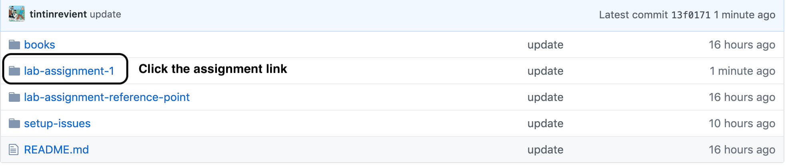
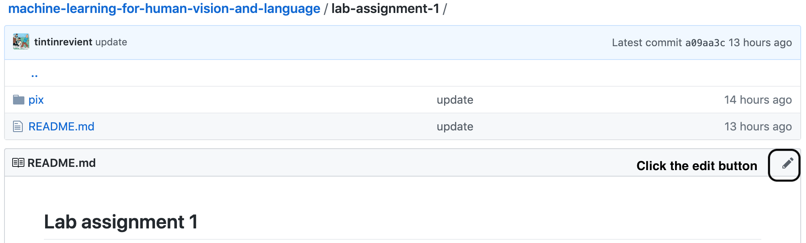
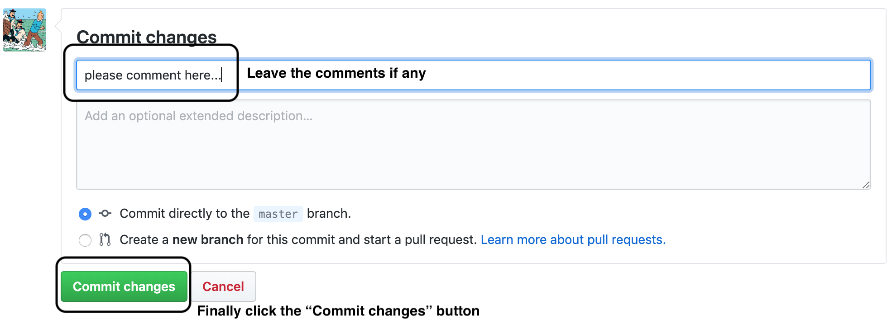

## Machine Learning for Human Vision and Language

### Overview

The content comes into the following four categories:
1. [books](https://github.com/tintinrevient/machine-learning-for-human-vision-and-language/tree/master/books): reference books
2. lab assignments: e.g. lab-assignment-1, lab-assignment-2, etc...
3. [lab-assignments-notebooks](https://github.com/tintinrevient/machine-learning-for-human-vision-and-language/tree/master/lab-assignments-notebooks): information refined and summarized after each lab assignment
4. [setup-issues](https://github.com/tintinrevient/machine-learning-for-human-vision-and-language/tree/master/setup-issues): issues and their corresponding solutions while setting up the local environment

### How to update lab assignments

#### Step 1: Click the specific lab assignment's link as listed in this page.

#### Step 2: Click the edit button at the top right above the lab assignment document.

#### Step 3: Leave comments if any and finally click the "Commit changes" button

