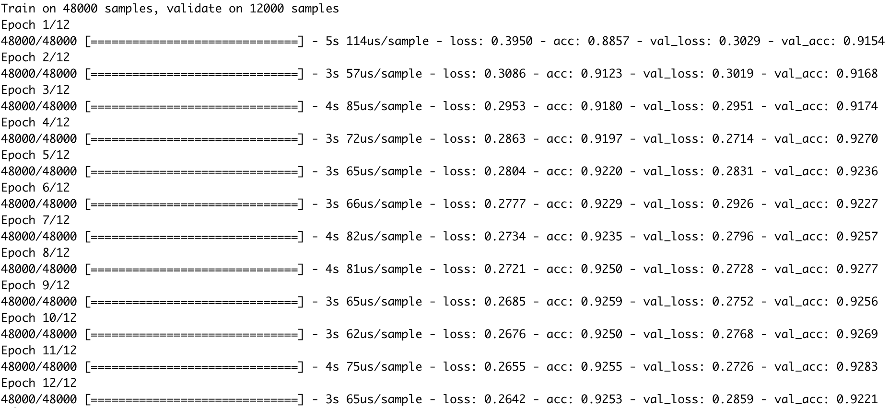
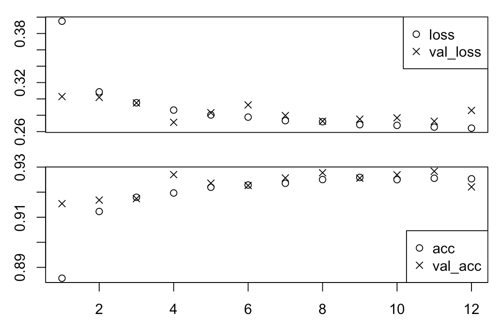
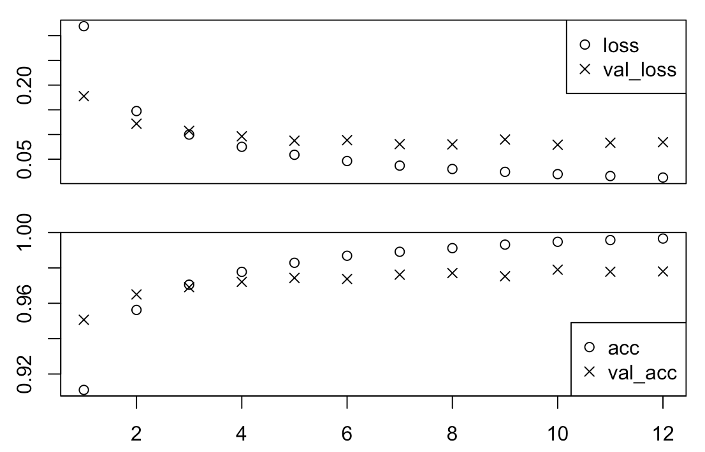

## Lab assignment 1
### Group: Luka, Shu

#### Question 1: Can you think of another application where automatic recognition of hand-written
numbers would be useful?

1. The OCR (Optical Character Recognition) system which can recognize the numeric entries in the application forms filled up by hand in any bank branch, e.g. the applicant's bank account. And with the help of OCR, the paper forms can be automatically scanned and logged in the database.

2. License plate of cars?

#### Question 2: In the output text in your console, how long did each epoch take to run?

The duration for each epoch is as below:
* Epoch 1: 5s
* Epoch 2: 3s
* Epoch 3: 4s
* Epoch 4: 3s
* Epoch 5: 3s
* Epoch 6: 3s
* Epoch 7: 4s
* Epoch 8: 4s
* Epoch 9: 3s
* Epoch 10: 3s
* Epoch 11: 4s
* Epoch 12: 3s

The console screen shot is as below:

#### Question 3: Plot the training history and add it to your answers.

The training history is as below:

#### Question 4: Describe how the accuracy on the training and validation sets progress differently across epochs, and what this tells us about the generalisation of the model. 

Around the epoch 4, the accuracy score on the validation set reaches its maximum value 0.927 and begins to degrade and stagnate at approximately 0.925, whereas the accuracy score on the training set continues to increase until it stalls around 0.925.

It tells that the generalisation of the model is not good, as the model is over-fit for the training set and lacks the capability to predict the unknown patterns in the validation set.

#### Question 5: What values do you get for the model’s accuracy and loss? 

The model's accuracy is 0.9217.

The model's loss is 0.290271

#### Question 6: Discuss whether this accuracy is sufficient for some uses of automatic hand-written digit classification. 

This accuracy is sufficient, based on the following reasons:
1. For the hand-written digit classification, the random accuracy should be 0.1, whereas this model generates the accuracy 0.9217. So this model achieves the statistical power.

This accuracy is insufficient, based on the following reasons:
1. It is not commercially sufficient, as the error rate is 7.83%, which is above 1%.

#### Question 7:  How does linear activation of units limit the possible computations this model can perform?

The linear activation of units makes the model more computationally expensive and may lead to the overfitting.

#### Question 8: Plot the training history and add it to your answers.

The training history is as below:

#### Question 9: How does the training history differ from the previous model, for the training and validation sets? What does this tell us about the generalisation of the model?

