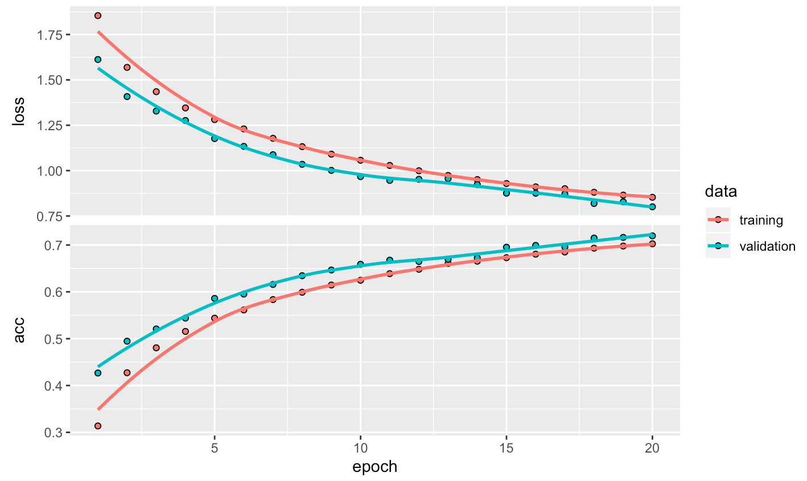
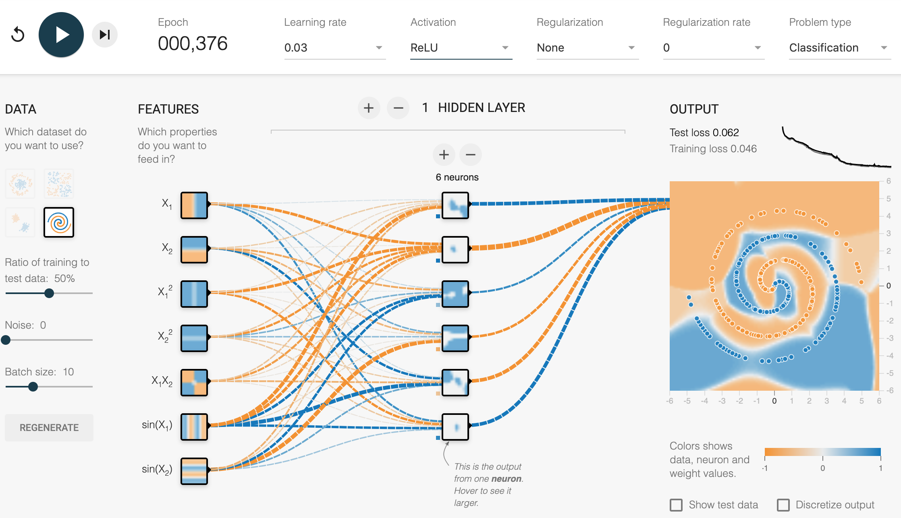
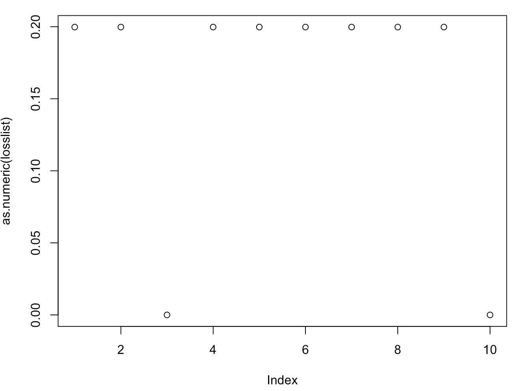

## Lab assignment 1

### Luka van der Plas (4119142) & Shu Zhao (6833519)

#### Question 1: Can you think of another application where automatic recognition of hand-written numbers would be useful?

1. The OCR (Optical Character Recognition) system which can recognize the numeric entries in the application forms filled up by hand in any bank branch, e.g. the applicant's bank account. And with the help of OCR, the paper forms can be automatically scanned and logged in the database.

2. It would be useful for digitalising instance historic records (though these would often require their own training data to account for historic handwriting). Optical character recognition can allow searching through text, etc.


#### Question 2: In the output text in your console, how long did each epoch take to run?

The duration for each epoch is as below:
* Epoch 1: 5s
* Epoch 2: 3s
* Epoch 3: 4s
* Epoch 4: 3s
* Epoch 5: 3s
* Epoch 6: 3s
* Epoch 7: 4s
* Epoch 8: 4s
* Epoch 9: 3s
* Epoch 10: 3s
* Epoch 11: 4s
* Epoch 12: 3s

The console screen shot is as below:


#### Question 3: Plot the training history and add it to your answers.

The training history is as below:


#### Question 4: Describe how the accuracy on the training and validation sets progress differently across epochs, and what this tells us about the generalisation of the model. 

Around the epoch 4, the accuracy rate for the validation set reaches its maximum value 0.927 and begins to degrade and stagnate at approximately 0.925, which means that further changes to the model are no longer increasing its fit to new data. The accuracy rate for the training set continues to increase until it stalls around 0.925, which means the model can no longer find a better fit, and the remaining errors are the result of the limitations of the model and the dataset.

The scores for the training and validation set over the last few epochs are nearly identical, which suggests that the model generalises well to new data.


#### Question 5: What values do you get for the model’s accuracy and loss? 

The model's accuracy is 0.9217.

The model's loss is 0.290271.


#### Question 6: Discuss whether this accuracy is sufficient for some uses of automatic hand-written digit classification. 

This accuracy is sufficient, based on the following reasons:
1. For the hand-written digit classification, the random accuracy should be 0.1, whereas this model generates the accuracy 0.9217. So this model achieves the statistical power.

This accuracy is insufficient, based on the following reasons:
1. It is not commercially sufficient, as the error rate is 7.83%, and for important documents like bank cheques, we don't want any errors. However, a 90% accuracy for individual digits may not be as bad as it sounds. If a system has to register a bank account number, for instance, an error in a single digit will result in an invalid number - something which a computer can also easily verify. As such, the chances of a computer registering an incorrect bank account number without raising an error would be much lower, since it needs to make multiple errors and they need to cancel each other out.

#### Question 7:  How does linear activation of units limit the possible computations this model can perform?

When an input value x contributues to the activation A of a unit, a linear activation does not allow to implement some threshold for x. This means that very low values of x still contribute to A, even if those are not actually important. This leads to more noise in the data, which makes training harder.

#### Question 8: Plot the training history and add it to your answers.

The training history is as below:


#### Question 9: How does the training history differ from the previous model, for the training and validation sets? What does this tell us about the generalisation of the model?

The accuracy rate of this training history achieves 0.979 for the validation set and 0.9966 for the training set respectively, which are much higher than 0.927 and 0.925 from the previous model. Moreover, the accurary rate for the validation set keeps increasing until it peaks at epoch 9 with the value 0.979, whereas in the previous model for the validation set, it has a pre-mature stop at epoch 4.

The high accuracy for the validation set tells that the generalization of this model is pretty good, and it will perform better on new data than the previous model. However, we also see that the accuracy on the valuation set stagnates around epoch 6, while the accuracy on the training set continues to increase. This means that at this point, the model is finding a better fit for the training set without increasing its generalisation value, which means that it is overfitting.


#### Question 10: How does the new model’s accuracy on test set classification differ from the previous model? Why do you think this is?

The new model's accuracy on the test set is 0.9814, which is much higher than the accuracy from the previous model. Apparently the ReLU activation improves the model's generalisation, because it is less sensitive to noise in the new data, due to the activation threshold.


#### Question 11: Plot the training history and add it to your answers.

The training history is as below:


#### Question 12: How does the training history differ from the previous model, for the training and validation sets? What does this tell us about the generalisation of the model?

For both the training set and the validation set, the training history remains almost the same as that of the previous model. What is slightly different is for the validation set. The accurary for the validation set starts at 0.9809 from epoch 1, and it fluctuates slightly since then around 0.99 with even a minor drop at the last epoch to 0.9858, though this may be random fluctuation.

The generalisation of the model is adequate since it performs very well on the training set, but there seems to be some overfitting going on in the last few epochs, as the model improves itself continuously on the training set, but stays numb to the validation set. 


#### Question 13: What values do you get for the model’s accuracy and loss? 

The model's accuracy is 0.9896.

The model's loss is 0.03824518.


#### Question 14: Discuss whether this accuracy is sufficient for some uses of automatic hand-written digit classification.

This accuracy is sufficient, based on the following reasons:
1. For the hand-written digit classification, the random accuracy should be 0.1, whereas this model generates the accuracy 0.9896, which is much higher than the score of the previous model. So this model achieves stronger statistical power.

2. It is commercially sufficient also, as the error rate of this model is 1.04%.


#### Question 15: Describe the principles of overfitting and how dropout can reduce this.

Overfitting happens when the model creates a very close fit to the training data, which matches all the specific fluctuations of the training data, even ones that are not relevant. This decreases the generalisation of the model.
Dropout prevents the model from aligning too closely with the training set, by introducing arbitrary noises into the training set during training.

#### Question 16: How does the training history differ from the previous (convolutional) model, for both the training and validation sets, and for the time taken to run each model epoch?

For both the training set and the validation set, the accurary keeps upgrading. For the training set, the accurary witnesses a steep line from 0.9039 to 0.9862. And for the validation set, it increases slightly from 0.9781 to 0.9889. What differs from the previous model is that the results for the validation set are very close to those of the training set.

The training history is as below for this new model:


For the time taken to train the model, the previous model takes 80 seconds per epoch on average, compared with this model's 103 seconds per epoch on average.


#### Question 17: What does this tell us about the generalisation of the two models? 

It tells that the previous model without dropout is less general than the current model with dropout. It can be deduced that the dropout layer can increase generalization and prevent overfitting during the training of models.


#### Question 18: What code did you use to define the model described here?

```
model <- keras_model_sequential() %>%
  layer_conv_2d(filters = 32, kernel_size = c(3,3),
                activation = 'relu', input_shape = c(32, 32, 3), padding = "same") %>%
  layer_conv_2d(filters = 32, kernel_size = c(3,3),
                activation = 'relu') %>%
  layer_max_pooling_2d(pool_size = c(2,2)) %>%
  layer_dropout(rate = 0.25) %>% 
  layer_conv_2d(filters = 32, kernel_size = c(3,3),
                activation = 'relu', padding = "same") %>%
  layer_conv_2d(filters = 32, kernel_size = c(3,3),
                activation = 'relu') %>%
  layer_max_pooling_2d(pool_size = c(2,2)) %>%
  layer_dropout(rate = 0.25) %>% 
  layer_flatten() %>%
  layer_dense(units = 512, activation = 'relu') %>%
  layer_dropout(rate = 0.5) %>% 
  layer_dense(units = 10, activation = 'softmax')
```

#### Question 19: Execute this model fit command. After your fitting is finished, plot the training history and put it in your answers.

The training history is as below:


#### Question 20: How does the training history differ from the convolutional model for digit recognition? Why do you think this is?

The difference of the training history focuses on below two points:

1. **Validation accuracy**: This model's validation accuracy is 0.7196, which is much lower than the previous model's validation accuracy 0.9889.

2. **Growth of validation and training accuracy**: For this model, the validation and training accuracy both start at a low value, which is 0.4267 and 0.3137 respectively, and the accuracy increases gradually as the training progresses. But for the previous model, the validation and training accuracy both start at a high value, which is above 0.9. More specifically, the validation accuracy is 0.975 at epoch 1, while the training accuracy increases rapidly from epoch 1 to epoch 2, from around 0.9 to above 0.96. Afterwards they just grow to a very limited extent.

As to the reason why this difference occurs:

1. **Dataset**: This model's dataset cifar10 is of the shape (32, 32, 3), which includes colored images, whereas the previous model's dataset mnist is of the shape (28, 28, 1), which just consists of black-and-white figures. As the shape shows, the cifar data is of a much higher dimension (32 * 32 * 3 dimensions, whereas the mnist data has 28 * 28 dimensions). This makes the learning more complex and increases the computational load.

2. **Multi-class classification goal**: This model's goal is to classify the colored images into ten classes, which are airplane, automobile, bird, cat, deer, dog, frog, horse, ship and truck. Because these are pictures of objects, there is variation in orientation, light, et cetera. This makes these classes harder to distinguish than the numbers in the mnist data, since they do not easily follow from the retinal image.

#### Question 21: How does the time taken for each training epoch differ from the convolutional model for digit recognition? Give several factors that may contribute to this difference.

For this model, the time taken for each training epoch is 160 seconds on average, whereas for the previous model, it is 103 seconds on average. So this model takes longer time for each training epoch to complete than the previous model.

The contributing factors are as below:

1. **Dataset**: There are two more color channels in cifar10, so it requires more computational time for each training epoch.

2. **Layers**: There are two more convolutional layers, which means more weights to train, so it takes more time for each batch to complete the training.

3. **Batch Size**: The batch size is 32 for this model, whereas it is 128 for the previous model. So for this model, it takes more batches for one epoch, which means more calculations, because the loss gradient is calculated per batch.

#### Question 22: Read the research paper “Performance-optimized hierarchical models predict neural responses in higher visual cortex”, available from: [http://www.pnas.org/content/pnas/111/23/8619.full.pdf](http://www.pnas.org/content/pnas/111/23/8619.full.pdf). Write a short (~500 word) summary of the experimental approach and results.

Humans can recognise objects despite drastic variation in the retinal image (due to lighting, position, angle, etc.). The processing of visual information that underlies this ability is performed in the ventral visual stream. This collection of brain areas can be seen as a series of processing stages, that represent visual information in increasingly more abstract ways. The lowest area, the V1, is most directly based on the retinal image and can be modelled with high accuracy. Modelling higher areas has proven more difficult. The aim of this study is to model the IT, the highest ventral cortical area.

The study constructed a large test of objects shown with varying orientations, backgrounds, etc., and gathered neural responses to these images from human participants. To investigate how model performance relates to neural predictivity, the study then tried a large number of convolutional neural networks, and evaluated their ability to recognise objects in the test set, as well as their predictivity of the measured neural activty in IT. These two measures were found to have a positive correlation. When model parameters were optimised for object recognition, this increased their IT predictivity, even when neural data was not used in optimisation.

Next, the study used activity in IT and V4 (the highest area before IT) to predict object identity in the dataset and compared it to human performance, as well as the performance of various models. IT activity roughly matches human performance in accuracy, performing well even on test sets with high variation in object orientation, lighting, etc. The predictivity of V4 greatly deteriorates with more variation in the test set. The most robust artificial networks that are tested perform similarly to V4.

The study then optimised and trained a final model for object recognition. This model is more complex than the standard three-layer CNN, using a combination of deeper CNNs with more specialised functions, using HMO to develop the architecture of the network. This model performed similar to the IT neural data in the visual recognition task, even with high variation.

The model was further evaluated by measuring its IT predictivity in different layers. Each subsequent layer of the model achieved better predictivity of neural activity in IT, and were increasingly more robust under variation in object pose and position. The highest layer in the model showed very high predictivity of IT compared to existing models.

The model’s predictivity of neural data was further evaluated. Previous comparisons had been to the activity in individual neurons, but the model was also used to predict representations of activity in the entire population. Again, predictivity of the model was high. The model’s second highest layer was also used to predict V4 activity, and was found to perform well at this task. This suggests that the internal structure of the model somewhat mirrors the internal structure of the ventral stream.

The experiment demonstrates that performance-optimised hierarchical models predict neural responses in higher visual cortex, and it also indicates that the top-down perspective can complement the bottom-up approach to understand how the visual neurons work, as lower visual cortex might be selected precisely by higher visual cortex to support its computation.

#### Question 23: Play around with these settings and see how they affect your ability to learn classification of different data sets. Write down what you found and how you interpret the effects of these settings.

The key factors that affect the accuracy of classification for different data sets are as below:
1. Input features: these are really important. More input features increases the  size of the hypothesis space. Also, if you don't use all input features, the choice of features can really affect how accurate the program can be. This really depends on the dataset. Well-chosen input features can increase the accuracy of the program and reduce the number of hidden layers necessary. 

2. Number of hidden layers & number of neurons: both of these can increase accuracy, but it's hard to see the interaction between the two: is it better to have more neurons or to add more layers? We did observe that it's not useful for a hidden layer to have more neurons than the previous one. For instance, here we try to do the same training exercies with a layer of 6 neurons followed by one with 3 neurons, or with the order of hidden layers reversed.

3-6             |  6-3
:-------------------------:|:-------------------------:
  |  

The model performs significantly better when there are more neurons in the first layer instead of the second. This makes sense, because in the second case, the output of layer 1 is limited to 3 dimensions. Therefore, the increased dimensionality of layer 1 can't help in a more complex image of the dataset, because it is working with limited input.

3. Activation function: Different activation functions affect the accuracy of the result. Especially in very simple networks, it makes a big difference. Linear activation tends to perform the worst.

4. Noise: Adding noise decreases the final accuracy, but it does not really affect the training development.

Learning rate, batch size and ratio of training to test data don't necessarily affect the final result. They do have an effect the development in training, and the duration of training.


#### Question 24: What is the minimum you need in the network to classify the spiral shape with a test set loss of below 0.1?

The simplest network we could build used all input features, 1 hidden layer with 6 neurons, and ReLU activation.



#### Question 25: Write a simple function that achieves the convolution operation efficiently for two- dimensional and three-dimensional inputs. This should allow you input a set of convolutional filters (‘kernels’ in Keras’s terminology) and an input layer (or image) as inputs. The input layer should have a third dimension, representing a stack of feature maps, and each filter should have a third dimension of corresponding size. The function should output a number of two-dimensional feature maps corresponding to the number of input filters, though these can be stacked into a third dimensional like the input layer. Give your code as the answer.

The source code is as below:

```
#assumption: input must be of the shape (x, y, z)
#assumption: bias_vector's length should be equal to units of the filters
convolution_layer <- function(input, filter, bias_vector) 
{
  #convolution only processes one image at a time, so filter and input are only for one image
  #if input is of the shape (x, x, 3), filters should be of the shape (x', x', 3, units)
  #if input is of the shape (x, x, 1), filters should be of the shape (x', x', 1, units)
  #if filters are of the shape (x', x', y, units), bias_vector's length should be equal to units
  #prerequisite: x > x'
  inputshape <- dim(input)
  filtershape <- dim(filter)
  
  #steps for filter to take to move along x-axis, so x_steps = ncol(stacks)
  x_steps <- inputshape[2] - filtershape[2] + 1
  
  #steps for filter to take to move along y-axis, so y_steps = nrow(stacks)
  y_steps <- inputshape[1] - filtershape[1] + 1
  
  units <- dim(filter)[4]
  
  #initialise stack of feature maps
  stacks <- array(0, c(y_steps, x_steps, units))
  
  #increment along x-axis to crop the input image
  x_increment <- filtershape[1] - 1
  
  #increment along y-axis to crop the input image
  y_increment <- filtershape[2] - 1
  
  #loop through units, a.k.a. depth of stacks
  for(k in seq(units)) 
  {
    for(j in seq(y_steps))
    {
      for(i in seq(x_steps))
      {
        #elementwise multiplication of filter with current section of input image
        output <- input[i:(i+x_increment), j:(j+y_increment),] * filter[,,,k] + bias_vector[k]
        #sum the output and store it in the featuremaps
        stacks[i,j,k] <- sum(output)
      }
    }
  }
  
  #export stacks
  stacks
}

#testing
#test_input is of the shape (4, 4, 3)
#test_input <- array(round(runif(36, min=-3, max=3)), c(4, 4, 3))

#test_filter is of the shape (3, 3, 3, 2)
#its third dimension 3 is equal to the depth of the test_input
#its fourth dimension 2 is the number of the units of filters
#test_filter <- array(round(runif(54, min=-1, max=1)),c(3, 3, 3, 2))

#length of the test_bias_vector is 2, which is equal to test_filter's number of units
#test_bias_vector <- rep(0, 2)

#output <- convolution_layer(test_input, test_filter, test_bias_vector)
```

#### Question 26: Write a simple function that achieves rectified linear (relu) activation, with a threshold at zero. Give your code as the answer.

The source code is as below:

```
#assumption: input must be of the shape (x, y, z)
#if input is 2d, it can be transformed as (x, y, 1)
relu <- function(stacks)
{
  shape <- dim(stacks)

  for(z in seq(shape[3])){
    
    for (y in seq(shape[2]))
    {
      for (x in seq(shape[1]))
        stacks[x, y, z] <- max(stacks[x, y, z], 0)
    }
  }
  
  #return the updated feature map
  stacks
}

#test
#stacks <- array(round(runif(18,min=-10,max=10)), dim=c(3, 3, 2))
#output <- relu(stacks)
© 2019 GitHub, Inc.
```

#### Question 27: Write a simple function that achieves max pooling. This should allow you to specify the spatial extent of the pooling, with the size of the output feature map changing accordingly. Give your code as the answer.

The source code is as below:

```
#assumption: stacks must be of the shape (x, y, z)
#if stacks is 2d, it can be transformed as (x, y, 1)
max_pooling <- function(stacks, rows, cols)
{
  depth = dim(stacks)[3]
  width <- dim(stacks)[2]
  height <- dim(stacks)[1]
  
  #strides which the max pooling takes to move along x-axis and y-axis
  stride_x <- rows
  stride_y <- cols
  
  #steps which the max pooling takes to move along x-axis, and x_steps = ncol(output)
  x_steps <- ceiling(width / cols)
  
  #steps which the max pooling takes to move along y-axis, and y_steps = nrow(output)
  y_steps <- ceiling(height / rows)
  
  #output returned by the max pooling function
  output <- array(0, dim=c(y_steps, x_steps, depth))
  
  for(z in seq(depth))
  {
    #initial position in the output matrix, which is (0, 0)
    x <- 1
    y <- 1
    
    for(j in seq(y_steps))
    {
      for(i in seq(x_steps))
      {
        output[j,i,z] <- max(stacks[x:min((x+stride_x-1),height), y:min((y+stride_y-1), width), z])
        y <- y + stride_y
      }
      y <- 1
      x <- x + stride_x
    }
  }
  
  #return the stacks
  output
}

#testing
#stacks <- array(round(runif(70, min=0, max=10)), dim=c(7,5,2))
#output <- max_pooling(stacks, 3, 3)
```

#### Question 28: Write a simple function that achieves normalisation within each feature map, modifying the feature map so that its mean value is zero and its standard deviation is one. Give your code as the answer. 

The source code is as below:

```
#assumption: input must be of the shape (x, y, z)
#if input is 2d, it can be transformed as (x, y, 1)

#question: normalization layer is performed stack by stack or on all stacks?
normalisation <- function(stacks)
{
  for(i in seq(dim(stacks)[3]))
  {
    #input
    input <- stacks[,,i]
    
    #mean
    mean <- mean(input)
    
    #substract mean from input
    tmp <- input - mean
    
    #standard deviation
    sd <- sqrt(sum(tmp^2)/(length(input)-1))
    
    #if sd = 0, just skip
    if(sd == 0)
      stacks[,,i] <- tmp
    else
      stacks[,,i] <- tmp/sd
  }
  
  #return the output
  stacks
}

#testing
#stacks <- array(c(10,8,-6,-3,10,8,-6,-3), dim=c(2,2,2))
#output <- normalisation(stacks)

#verify if the mean is 0
#mean <- mean(output[,,1])
#mean <- mean(output[,,2])

#verify if the standard deviation is 1
#sd <- sd(output[,,1])
#sd <- sd(output[,,2])
```

#### Question 29: Write a function that produces a fully-connected layer. This should allow you to specify the number of output nodes, and link each of these to every node a stack of feature maps. The stack of feature maps will typically be flattened into a 1- dimensional matrix first.

The "layer_flatten" source code is as below:

```
#assumption: input must be of the shape (x, y, z)
#if input is 2d, it can be transformed as (x, y, 1)
flatten <- function(stacks)
{
  height <- dim(stacks)[1]
  width <- dim(stacks)[2]
  depth <- dim(stacks)[3]
  
  #output should be 1-dimensional vector
  output <- rep(0, height*width*depth)
  
  #position in the output
  x <- 1
  
  for(i in seq(depth))
  {
    for(j in seq(height))
    {
      for(k in seq(width))
      {
        output[x] <- stacks[j, k, i]
        x <- x + 1
      }
    }
  }    
  
  #return the output
  output
}

#testing
#stacks <- array(round(runif(24,min=0,max=10)), c(2,3,4))
#output <- flatten(stacks)
```

The "layer_dense" source code is as below:

```
#assumption: input must be a sequence, a.k.a, 1-dimensional vector
#assumption: bias_vector's length should be equal to units
dense_layer <- function(input, units, weight_matrix, bias_vector)
{
  #initialise the output with the length of units
  output <- rep(0, units)
  
  #fill in the value for each output unit
  for(i in seq(units))
  {
    output[i] <- input %*% weight_matrix[,i] + bias_vector[i]
  }
  
  #return the output
  output
}

#testing
#input <- c(round(runif(10, min=1, max=10)))
#units <- 5
#weight_matrix <- matrix(runif(length(input) * units), nrow=length(input), ncol=units)
#bias_vector <- rep(0, units)

#output <- dense_layer(input, units, weight_matrix, bias_vector)
```

#### Question 30: Write a function that converts the activation of a 1-dimensional matrix (such as the output of a fully-connected layer) into a set of probabilities that each matrix element is the most likely classification. This should include the algorithmic expression of a softmax (normalised exponential) function.

The source code is as below:

```
#assumption: input must be a sequence, a.k.a, 1-dimensional vector
softmax <- function(input)
{
  #length of input
  length <- length(input)

  #initialise the output
  output <- rep(0, length)
  
  #natural log base
  e = exp(1)
  
  sum <- sum(e^input)
  output <- (e^input)/sum
  
  #return the output
  output
}

#testing
#input <- c(2,1,0.1)
#output <- softmax(input)
#sum <- sum(output)
```

#### Question 31: Explain the principle of backpropagation of error in plain English. This can be answered with minimal mathematical content, and should be IN YOUR OWN WORDS. What is backpropagation trying to achieve, and how does it do so?

Backpropagation adjusts the neural network by comparing the output of the network with the desired output. To determine where to make adjustments, the model calculates the error in the output and estimates how it changes based on the intput: if a larger input leads to a smaller error, we want the network to give a higher weight to that input. The error is estimated by comparing the actual output of the network with its desired output (i.e. the output in the training data).
When making changes, the changes to a node in the network are proportional to the steepness of the error curve if we map the input of that node to the error of the network. The size of these adjustments is also dependent upon the learning rate of the model: a higher learning rate leads to more rigorous changes. 

#### Question 32 (BONUS QUESTION): Describe the process of backpropagation in mathematical terms. Here, explain (in English) what each equation you give does, and relate this to the answers given in Question 31. You are welcome to express equations in R code (not python) rather than using equation layout.

We have a network with input X ( = [X1, X2 .... ]) and output y'. We compare that to the desired output y.

The error of the network is estimated by a loss function, which may vary depending on the problem. For instance, we can use say E = (y - y')^2 .
 
 Estimating how the error changes as a result of weight in the network w is done by calculating the derivative (d E / d w ). This is derived by appying the chain rule:
 (d E / d w ) = (d E / y' ) ) ( d y' / d w )

We now want to calculate two values: the derivative of the error as a function of the output, and the derivative of the output as a function of the weight. The exact formulas for these depend on the type of network. When we have the derivative of the error as a function of the weight (so we know how to adjust the weight to minimise the error), we adjust the weight as follows:

D w = - r (d E / d w)

where r is the learning rate of the training model. The new value of w, which we will call w', is equal to w + D w.

#### Question 33 (BONUS QUESTION): Write a function to achieve backpropagation of error to affect the convolutional filter (kernel) structure used in question 25. Modify your function from question 25 to give the filters used as an output, so you can modify these filters using backpropagation. Initialise the network with random weights in the filters. Give the code for your convolution and backpropagation functions as your answer.

We were a bit confused by the question, because a backpropagation algorithm requires more than a single convolutional filter (you need the entire network). We wrote a backpropagation algorithm for our neural network with 2 hidden layers that we implemented in question 35.

The code below defines a backpropagation function. This function takes the parameters of the network as input, together with a single input image, its target output and the learning rate. As output, it gives the adapted parameters based on the loss and learning rate. We implement this backpropagation function in question 36, so that is where you can see how it can be used.

The source code is as below:

```
library(keras)
library(numDeriv)

source("~/Documents/workspace/machine-learning-for-human-vision-and-language/lab-assignment-1/source-code/convolution_layer.R")
source("~/Documents/workspace/machine-learning-for-human-vision-and-language/lab-assignment-1/source-code/forward_propagation.R")

loss <- function(output, target)
{
  sum((target - output)^2) / length(target)
}

layer_activation <- function(input, filter_1, filter_2, weight_matrix, bias_vector_1, bias_vector_2, bias_vector_3, units)
{
  deep_1 <- deep_layer(input, filter_1, bias_vector_1, TRUE)
  deep_2 <- deep_layer(deep_1, filter_2, bias_vector_2, TRUE)
  
  flatten_1 <- flatten(deep_2)
  dense_1 <- dense_layer(flatten_1, units, weight_matrix, bias_vector_3)
  softmax_1 <- softmax(dense_1)
  #output
  list(deep_1, deep_2, softmax_1)
}


output_derivatives <- function(input, filter_1, filter_2, weight_matrix, bias_vector_1, bias_vector_2, bias_vector_3, units, target, layeractivation)
{
  #calculate output
  
  deep_2 <- layeractivation[[2]]
  flatten_1 <- flatten(deep_2)
  dense_1 <- dense_layer(flatten_1, units, weight_matrix, bias_vector_3)
  output <- softmax(dense_1)
  
  #make empty array for derivatives per node
  derivatives <- array(data=0, dim=c(length(output)))
  
  #calculate derivative of Loss by activation per output node
  for(x in seq(length(output)))
  {
    activation <- layeractivation[[3]][x]
    
    lossfunction <- function(activation)
    {
      new_output <- output
      new_output[x] <- activation
      loss(new_output, target)
    }
    derivatives[x] <- grad(lossfunction, activation)

  }
  
  derivatives
  
}

layer_1_derivatives <- function(input, filter_1, filter_2, weight_matrix, bias_vector_1, bias_vector_2, bias_vector_3, units, target, layeractivation, layer2derivatives)
{
  #calculate output
  deep_1 <- layeractivation[[1]]
  
  #make empty array for derivatives per node
  derivatives <- array(data=0, dim=dim(deep_1))
  
  #calculate loss gradient by activation per output node
  for(x in seq(dim(deep_1)[1]))
  {
    for(y in seq(dim(deep_1)[2]))
    {
      for(z in seq(dim(deep_1)[3]))
      {
        activation <- layeractivation[[1]][x,y,z]
        
        gradient <- function(activation)
        {
          new_deep_1 <- deep_1
          new_deep_1[x,y,z] <- activation
          
          new_deep_2 <- deep_layer(new_deep_1, filter_2, bias_vector_2, TRUE)
          old_deep_2 <- layeractivation[[2]]
          delta <- new_deep_2 - old_deep_2
          loss <- delta * layer2derivatives / length(delta)
          sum(loss)
          
        }
        derivatives[x,y,z] <- gradient(activation)
      }
    }
  }
  derivatives
}


layer_2_derivatives <- function(input, filter_1, filter_2, weight_matrix, bias_vector_1, bias_vector_2, bias_vector_3, units, target, layeractivation, output_derivatives)
{
  #calculate output
  deep_2 <- layeractivation[[2]]
  
  #make empty array for derivatives per node
  derivatives <- array(data=0, dim=dim(deep_2))
  
  #calculate loss gradient by activation per output node
  for(x in seq(dim(deep_2)[1]))
  {
    for(y in seq(dim(deep_2)[2]))
    {
      for(z in seq(dim(deep_2)[3]))
      {
        activation <- layeractivation[[2]][x,y,z]
        
        gradient <- function(activation)
        {
          new_deep_2 <- deep_2
          new_deep_2[x,y,z] <- activation
          
          flatten_1 <- flatten(deep_2)
          dense_1 <- dense_layer(flatten_1, units, weight_matrix, bias_vector_3)
          new_output <- softmax(dense_1)
          old_output <- layeractivation[[3]]
          delta <- new_output - old_output
          loss <- delta * output_derivatives / length(delta)
          sum(loss)
          
        }
        derivatives[x,y,z] <- gradient(activation)
      }
    }
  }
  derivatives
}

back_propagation <- function(input, filter_1, filter_2, weight_matrix, bias_vector_1, bias_vector_2, bias_vector_3, units, target, r)
{
  print("calculating network activation")
  layeractivation <- layer_activation(input, filter_1, filter_2, weight_matrix, bias_vector_1, bias_vector_2, bias_vector_3, units)
  outputderivatives <- output_derivatives(input, filter_1, filter_2, weight_matrix, bias_vector_1, bias_vector_2, bias_vector_3, units, target, layeractivation)
  layer2derivatives <- layer_2_derivatives(input, filter_1, filter_2, weight_matrix, bias_vector_1, bias_vector_2, bias_vector_3, units, target, layeractivation, outputderivatives)
  layer1derivatives <- layer_1_derivatives(input, filter_1, filter_2, weight_matrix, bias_vector_1, bias_vector_2, bias_vector_3, units, target, layeractivation, layer2derivatives)
  
  print("training filter 1")
  new_filter_1 <- filter_1
  
  for(v in seq(dim(filter_1)[1])) 
  {
    for(x in seq(dim(filter_1)[2]))
    {
      for(y in seq(dim(filter_1)[3]))
      {
        for(z in seq(dim(filter_1)[4]))
        {
          weight <- filter_1[v,x,y,z]
          
          
          lossfunction <- function(w) 
          {
            lossarray <- array(data=0, dim=dim(layer1derivatives))
            
            newfilter <- filter_1
            newfilter[v,x,y,z] <- w
            new_layer_1 <- deep_layer(input, newfilter, bias_vector_1, TRUE)
            old_layer_1 <- layeractivation[[1]]
            delta <- new_layer_1 - old_layer_1
            lossarray <- delta * layer1derivatives
            
            loss <- sum(lossarray)
            loss
          }
          
          weight_derivative <- grad(lossfunction, weight)
          new_weight <- weight - r * weight_derivative
          
          new_filter_1[v,x,y,z] <- new_weight
        }
      }
    }  
  }
  
  print("training filter 2")
  
  new_filter_2 <- filter_2
  
  for(v in seq(dim(filter_2)[1]))
  {
    for(x in seq(dim(filter_2)[2]))
    {
      for(y in seq(dim(filter_2)[3]))
      {
        for(z in seq(dim(filter_2)[4]))
        {
          weight <- filter_2[v,x,y,z]
          
          lossfunction <- function(w) 
          {
            lossarray <- array(data=0, dim=dim(layer2derivatives))
            
            newfilter <- filter_2
            newfilter[v,x,y,z] <- w
            inputactivation <- layeractivation[[1]]
            new_layer_2 <- deep_layer(inputactivation, newfilter, bias_vector_2, TRUE)
            old_layer_2 <- layeractivation[[2]]
            delta <- new_layer_2 - old_layer_2
            lossarray <- delta * layer2derivatives
            
            loss <- sum(lossarray)
            loss
          }
          
          weight_derivative <- grad(lossfunction, weight)
          new_weight <- weight - r * weight_derivative
          
          new_filter_2[v,x,y,z] <- new_weight
        }
      }
    }  
  }
  
  print("training weight matrix")
  new_weight_matrix <- weight_matrix
  
  for(y in seq(dim(weight_matrix)[2]))
  {
    for(x in seq(dim(weight_matrix)[1]))
    {
      weight <- weight_matrix[x,y]
      
      lossfunction <- function(w)
      {
        lossvector <- array(data=0, dim=dim(outputderivatives))
        
        newmatrix <- weight_matrix
        newmatrix[x,y] <- w
        
        inputactivation <- layeractivation[[2]]
        flatten <- flatten(inputactivation)
        dense_1 <- dense_layer(flatten, 10, newmatrix, bias_vector_3)
        new_output <- softmax(dense_1)
        old_output <- layeractivation[[3]][i]
        delta <- new_output - old_output
        
        lossvector <- delta * outputderivatives
        
        loss <- sum(lossvector)
        loss
      }
      
      new_weight <- weight - r * grad(lossfunction, weight)
      new_weight_matrix[x,y] <- new_weight
    }  
  }
  
  print("training bias 1")
  
  new_bias_1 <- bias_vector_1
  
  for (x in seq(length(bias_vector_1)))
  {
    weight <- bias_vector_1[x]
    
    lossfunction <- function(w) 
    {
      newvector <- bias_vector_1
      newvector[x] <- w
      
      lossarray <- array(data=0, dim=dim(layer1derivatives))
      new_layer_1 <- deep_layer(input, filter_1, newvector, TRUE)
      old_layer_1 <- layeractivation[[1]]
      delta <- new_layer_1 - old_layer_1
      lossarray <- delta * layer1derivatives
      loss <- sum(lossarray)
      loss
    }
    
    
    weight_derivative <- grad(lossfunction, weight)
    new_weight <- weight - r * weight_derivative
    new_bias_1[x] <- new_weight
  }
  
  print("training bias 2")
  
  new_bias_2 <- bias_vector_2
  
  for (x in seq(length(bias_vector_2)))
  {
    weight <- bias_vector_2[x]
    
    lossfunction <- function(w) 
    {
      newvector <- bias_vector_2
      newvector[x] <- w
      
      lossarray <- array(data=0, dim=dim(layer2derivatives))
      inputactivation <- layeractivation[[1]]
      new_layer_2 <- deep_layer(inputactivation, filter_2, newvector, TRUE)
      old_layer_2 <- layeractivation[[2]]
      delta <- new_layer_2 - old_layer_2
      lossarray <- delta * layer2derivatives
      
      loss <- sum(lossarray)
      loss
    }
    
    
    weight_derivative <- grad(lossfunction, weight)
    new_weight <- weight - r * weight_derivative
    new_bias_2[x] <- new_weight
  }
  
  print("training bias 3")
  
  new_bias_3 <- bias_vector_3
  
  for (x in seq(length(bias_vector_3)))
  {
    weight <- bias_vector_3[x]
    
    
    lossfunction <- function(w) 
    {
      newvector <- bias_vector_3
      newvector[x] <- w
      
      lossvector <- array(data=0, dim=dim(outputderivatives))
      inputactivation <- layeractivation[[2]]
      flatten <- flatten(inputactivation)
      dense_1 <- dense_layer(flatten, 10, weight_matrix, newvector)
      new_output <- softmax(dense_1)
      old_output <- layeractivation[[3]]
      delta <- new_output - old_output
      
      lossvector <- delta * outputderivatives
      
      loss <- sum(lossvector)
      loss
    }
    
    weight_derivative <- grad(lossfunction, weight)
    new_weight <- weight - r * weight_derivative
    new_bias_3[x] <- new_weight
  }
  
  #return new filters and weights
  list(new_filter_1, new_filter_2, new_weight_matrix, new_bias_1, new_bias_2, new_bias_3)
  
}
```

#### Question 35 (BONUS QUESTION): Write a piece of code that uses all of these functions (Questions 25-33) together to make a convolutional neural network with two convolutional layers, a fully connected layer, and an output layer (pooling is optional, but thresholding and normalisation are required). This should give the accuracy of the labels as an output. Give your code as your answer. 

The source code is as below:

```
library(keras)

source("~/Documents/workspace/machine-learning-for-human-vision-and-language/lab-assignment-1/source-code/convolution_layer.R")
source("~/Documents/workspace/machine-learning-for-human-vision-and-language/lab-assignment-1/source-code/relu.R")
source("~/Documents/workspace/machine-learning-for-human-vision-and-language/lab-assignment-1/source-code/max_pooling.R")
source("~/Documents/workspace/machine-learning-for-human-vision-and-language/lab-assignment-1/source-code/normalisation.R")
source("~/Documents/workspace/machine-learning-for-human-vision-and-language/lab-assignment-1/source-code/flatten.R")
source("~/Documents/workspace/machine-learning-for-human-vision-and-language/lab-assignment-1/source-code/dense_layer.R")
source("~/Documents/workspace/machine-learning-for-human-vision-and-language/lab-assignment-1/source-code/softmax.R")

# import the dataset
mnist <- dataset_mnist()
c(c(x_train, y_train), c(x_test, y_test)) %<-% mnist

# reshape from 3D to 2D
x_train <- array_reshape(x_train, c(nrow(x_train), 28, 28, 1))
x_test <- array_reshape(x_test, c(nrow(x_test), 28, 28, 1))

# rescale from the interval [0,255] to [0,1]
x_train <- x_train / 255
x_test <- x_test / 255

# rescale from the interval [0, 9] to [0, 1]
y_train <- to_categorical(y_train, 10)
y_test <- to_categorical(y_test, 10)

deep_layer <- function(input, filter, bias_vector, with_max_pooling) {
  
  stacks <- convolution_layer(input, filter, bias_vector)
  stacks <- relu(stacks)
  
  if (with_max_pooling){
    output <- array(0, dim=c(ceiling(dim(stacks)[1]/2), ceiling(dim(stacks)[2]/2), dim(stacks)[3]))
    output <- max_pooling(stacks, 2, 2)
  }
  else {
    output <- stacks
  }
  
  output <- normalisation(output)
  
  #return the output
  output
}

forward_propagation <- function(input, filter_1, filter_2, weight_matrix, bias_vector_1, bias_vector_2, bias_vector_3, num_of_categories) {
  deep_1 <- deep_layer(input, filter_1, bias_vector_1, TRUE)
  deep_2 <- deep_layer(deep_1, filter_2, bias_vector_2, TRUE)
  
  flatten_1 <- flatten(deep_2)
  dense_1 <- dense_layer(flatten_1, num_of_categories, weight_matrix, bias_vector_3)
  softmax_1 <- softmax(dense_1)
  
  #output
  softmax_1
}

#testing
input <- x_train[1,,,]
target <- y_train[1,]
input_depth <- 1
input <- array_reshape(mnist_image, c(28, 28, input_depth))

#the 3rd dimension of filter_1 should be equal to the 3rd dimension of input
#the 4th dimension of filter_1 is the number of units, which decides the 3rd dimension of its output
filter_1_units <- 2
filter_1 <- array(runif(n=9*input_depth*filter_1_units, min=0, max=1), c(3,3,input_depth,filter_1_units))

#the 3rd dimension of filter_2 should be equal to the 4th dimension of filter_1
#the 4th dimension of filter_2 is the number of units, which decides the 3rd dimension of its output
filter_2_units <- 2
filter_2 <- array(runif(n=9*filter_1_units*filter_2_units, min=0, max=1), c(3,3,filter_1_units,filter_2_units))

#input * filter_1 + bias_vector_1 = output of deep_1
bias_vector_1 <- rep(0, dim(filter_1)[4])

#output of deep_1 * filter_2 + bias_vector_2 = output of deep_2
bias_vector_2 <- rep(0, dim(filter_2)[4])

#final output is the distribution over 10 digits
num_of_categories <- 10
bias_vector_3 <- rep(0, num_of_categories)

#if deep_2's max pooling is FALSE:
#step 1: dim(input)[1]-2 = output of convolution_layer
#step 2: output of convolution_layer/2 = output of max pooling
#step 3: output of max pooling-2 = output of convolution_layer
#step 4: the number of all the weights after the deep_2 = width * height * filter_2_units
#height = ceiling((dim(input)[1]-2)/2 - 2)
#width = ceiling((dim(input)[2]-2)/2 - 2)
#weight_matrix_row_count = ceiling((dim(input)[1]-2)/2 - 2) * ceiling((dim(input)[2]-2)/2 - 2) * filter_2_units

#if deep_2's max pooling is TRUE:
#there is one more max pooling layer after step 3: output of convolution_layer/2 = final result
weight_matrix_row_count = ceiling(((dim(input)[1]-2)/2 - 2)/2) * ceiling(((dim(input)[2]-2)/2 - 2)/2) * filter_2_units

#nrow = the number of all the weights after the deep_2 and flatten_1 = width * height * filter_2_units
weight_matrix <- matrix(runif(weight_matrix_row_count * num_of_categories), nrow=weight_matrix_row_count, ncol=num_of_categories)

output <- forward_propagation(input, filter_1, filter_2, weight_matrix, bias_vector_1, bias_vector_2, bias_vector_3, num_of_categories)

```

#### Question 36 (BONUS QUESTION): Use the resulting function to learn to classify the mnist data set, as you did in question 11. Plot the progression of the classification accuracy over 100 cycles.

We created the model, and wrote a loop that adapts the model using stochastic gradient descent. However, it takes a long time to evaluate a single mnist image, so we only evaluated 10 images.
The loss over the 10 images is plotted below:


The source code is as below:

```
library(keras)
library(numDeriv)

source("~/Documents/workspace/machine-learning-for-human-vision-and-language/lab-assignment-1/source-code/convolution_layer.R")
source("~/Documents/workspace/machine-learning-for-human-vision-and-language/lab-assignment-1/source-code/forward_propagation.R")
source("~/Documents/workspace/machine-learning-for-human-vision-and-language/lab-assignment-1/source-code/back_propagation.R")


#load and preprocess mnist data

# import the dataset
mnist <- dataset_mnist()
c(c(x_train, y_train), c(x_test, y_test)) %<-% mnist

# reshape from 3D to 2D
x_train <- array_reshape(x_train, c(nrow(x_train), 28, 28, 1))
x_test <- array_reshape(x_test, c(nrow(x_test), 28, 28, 1))

# rescale from the interval [0,255] to [0,1]
x_train <- x_train / 255
x_test <- x_test / 255

y_train <- to_categorical(y_train, 10)
y_test <- to_categorical(y_test, 10)


#set up hyperparameters for the neural network

filter_1 <- array(round(runif(90, min=-3, max=3)), c(3,3,1,10))
filter_2 <- array(round(runif(180, min=-3, max=3)), c(3,3,10,10))
units <- 10
bias_vector_1 <- rep(0, dim(filter_1)[4])
bias_vector_2 <- rep(0, dim(filter_2)[4])
bias_vector_3 <- rep(0, units)

count <- 360
weight_matrix <- matrix(runif(count * units), nrow=count, ncol=units)
r <- 0.01

parameters <- list(filter_1, filter_2, weight_matrix, bias_vector_1, bias_vector_2, bias_vector_3)

#main loop

cycles <- 10
losslist <- array(data=0, dim=c(cycles))
i <- 0

for(x in seq(cycles))
{
  i <- i + 1
  input <- x_train[x,,,]
  input <- array_reshape(mnist_image, c(28, 28, 1))
  target <- y_train[x,]
  
  prediction <- forward_propagation(input, parameters[[1]], parameters[[2]], parameters[[3]], parameters[[4]], parameters[[5]], parameters[[6]], units)
  l <- loss(prediction, target)
  losslist[i] <- l
  
  newparameters <- back_propagation(input, parameters[[1]], parameters[[2]], parameters[[3]], parameters[[4]], parameters[[5]], parameters[[6]], units, target, r)
  parameters <- newparameters
  
}
```
