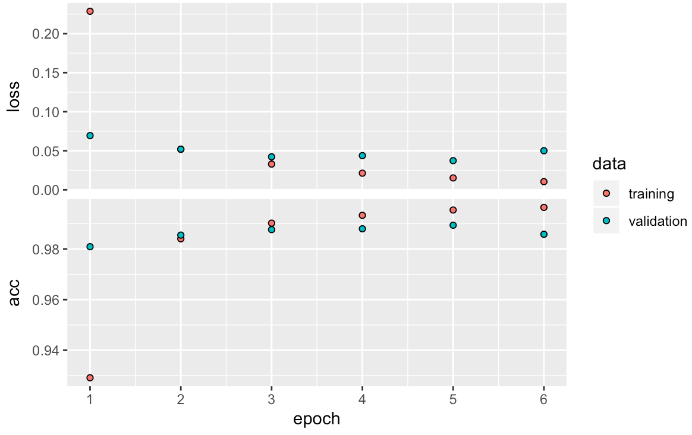

## Lab assignment 1


#### Question 1: Can you think of another application where automatic recognition of hand-written numbers would be useful?

1. The OCR (Optical Character Recognition) system which can recognize the numeric entries in the application forms filled up by hand in any bank branch, e.g. the applicant's bank account. And with the help of OCR, the paper forms can be automatically scanned and logged in the database.

2. It would be useful for digitalising instance historic records (though these would often require their own training data to account for historic handwriting). Optical character recognition can allow searching through text, etc.


#### Question 2: In the output text in your console, how long did each epoch take to run?

The duration for each epoch is as below:
* Epoch 1: 5s
* Epoch 2: 3s
* Epoch 3: 4s
* Epoch 4: 3s
* Epoch 5: 3s
* Epoch 6: 3s
* Epoch 7: 4s
* Epoch 8: 4s
* Epoch 9: 3s
* Epoch 10: 3s
* Epoch 11: 4s
* Epoch 12: 3s

The console screen shot is as below:


#### Question 3: Plot the training history and add it to your answers.

The training history is as below:


#### Question 4: Describe how the accuracy on the training and validation sets progress differently across epochs, and what this tells us about the generalisation of the model. 

Around the epoch 4, the accuracy rate for the validation set reaches its maximum value 0.927 and begins to degrade and stagnate at approximately 0.925, which means that further changes to the model are no longer increasing its fit to new data. The accuracy rate for the training set continues to increase until it stalls around 0.925, which means the model can no longer find a better fit, and the remaining errors are the result of the limitations of the model and the dataset.

The scores for the training and validation set over the last few epochs are nearly identical, which suggests that the model generalises well to new data.


#### Question 5: What values do you get for the model’s accuracy and loss? 

The model's accuracy is 0.9217.

The model's loss is 0.290271.


#### Question 6: Discuss whether this accuracy is sufficient for some uses of automatic hand-written digit classification. 

This accuracy is sufficient, based on the following reasons:
1. For the hand-written digit classification, the random accuracy should be 0.1, whereas this model generates the accuracy 0.9217. So this model achieves the statistical power.

This accuracy is insufficient, based on the following reasons:
1. It is not commercially sufficient, as the error rate is 7.83%, and for important documents like bank cheques, we don't want any errors. However, a 90% accuracy for individual digits may not be as bad as it sounds. If a system has to register a bank account number, for instance, an error in a single digit will result in an invalid number - something which a computer can also easily verify. As such, the chances of a computer registering an incorrect bank account number without raising an error would be much lower, since it needs to make multiple errors and they need to cancel each other out.

#### Question 7:  How does linear activation of units limit the possible computations this model can perform?

When an input value x contributues to the activation A of a unit, a linear activation does not allow to implement some threshold for x. This means that very low values of x still contribute to A, even if those are not actually important. This leads to more noise in the data, which makes training harder.

#### Question 8: Plot the training history and add it to your answers.

The training history is as below:


#### Question 9: How does the training history differ from the previous model, for the training and validation sets? What does this tell us about the generalisation of the model?

The accuracy rate of this training history achieves 0.979 for the validation set and 0.9966 for the training set respectively, which are much higher than 0.927 and 0.925 from the previous model. Moreover, the accurary rate for the validation set keeps increasing until it peaks at epoch 9 with the value 0.979, whereas in the previous model for the validation set, it has a pre-mature stop at epoch 4.

The high accuracy for the validation set tells that the generalization of this model is pretty good, and it will perform better on new data than the previous model. However, we also see that the accuracy on the valuation set stagnates around epoch 6, while the accuracy on the training set continues to increase. This means that at this point, the model is finding a better fit for the training set without increasing its generalisation value, which means that it is overfitting.


#### Question 10: How does the new model’s accuracy on test set classification differ from the previous model? Why do you think this is?

The new model's accuracy on the test set is 0.9814, which is much higher than the accuracy from the previous model. Apparently the ReLU activation improves the model's generalisation, because it is less sensitive to noise in the new data, due to the activation threshold.


#### Question 11: Plot the training history and add it to your answers.

The training history is as below:



#### Question 12: How does the training history differ from the previous model, for the training and validation sets? What does this tell us about the generalisation of the model?

For both the training set and the validation set, the training history remains almost the same as that of the previous model. What is slightly different is for the validation set. The accurary for the validation set starts at 0.9809 from epoch 1, and it fluctuates slightly since then around 0.99 with even a minor drop at the last epoch to 0.9858, though this may be random fluctuation.

The generalisation of the model is adequate since it performs very well on the training set, but there seems to be some overfitting going on in the last few epochs, as the model improves itself continuously on the training set, but stays numb to the validation set. 


#### Question 13: What values do you get for the model’s accuracy and loss? 

The model's accuracy is 0.9896.

The model's loss is 0.03824518.


#### Question 14: Discuss whether this accuracy is sufficient for some uses of automatic hand-written digit classification.

This accuracy is sufficient, based on the following reasons:
1. For the hand-written digit classification, the random accuracy should be 0.1, whereas this model generates the accuracy 0.9896, which is much higher than the score of the previous model. So this model achieves stronger statistical power.

2. It is commercially sufficient also, as the error rate of this model is 1.04%.


#### Question 15: Describe the principles of overfitting and how dropout can reduce this.

Overfitting happens when the model creates a very close fit to the training data, which matches all the specific fluctuations of the training data, even ones that are not relevant. This decreases the generalisation of the model.
Dropout prevents the model from aligning too closely with the training set, by introducing arbitrary noises into the training set during training.

#### Question 16: How does the training history differ from the previous (convolutional) model, for both the training and validation sets, and for the time taken to run each model epoch?

For both the training set and the validation set, the accurary keeps upgrading. For the training set, the accurary witnesses a steep line from 0.9039 to 0.9862. And for the validation set, it increases slightly from 0.9781 to 0.9889. What differs from the previous model is that the results for the validation set are very close to those of the training set.

The training history is as below for this new model:


For the time taken to train the model, the previous model takes 80 seconds per epoch on average, compared with this model's 103 seconds per epoch on average.


#### Question 17: What does this tell us about the generalisation of the two models? 

It tells that the previous model without dropout is less general than the current model with dropout. It can be deduced that the dropout layer can increase generalization and prevent overfitting during the training of models.


#### Question 18: What code did you use to define the model described here?

```
model <- keras_model_sequential() %>%
  layer_conv_2d(filters = 32, kernel_size = c(3,3),
                activation = 'relu', input_shape = c(32, 32, 3), padding = "same") %>%
  layer_conv_2d(filters = 32, kernel_size = c(3,3),
                activation = 'relu') %>%
  layer_max_pooling_2d(pool_size = c(2,2)) %>%
  layer_dropout(rate = 0.25) %>% 
  layer_conv_2d(filters = 32, kernel_size = c(3,3),
                activation = 'relu', padding = "same") %>%
  layer_conv_2d(filters = 32, kernel_size = c(3,3),
                activation = 'relu') %>%
  layer_max_pooling_2d(pool_size = c(2,2)) %>%
  layer_dropout(rate = 0.25) %>% 
  layer_flatten() %>%
  layer_dense(units = 512, activation = 'relu') %>%
  layer_dropout(rate = 0.25) %>% 
  layer_dense(units = 10, activation = 'softmax')
```

#### Question 19: Execute this model fit command. After your fitting is finished, plot the training history and put it in your answers.

?

#### Question 20: How does the training history differ from the convolutional model for digit recognition? Why do you think this is?

?

#### Question 21: How does the time taken for each training epoch differ from the convolutional model for digit recognition? Give several factors that may contribute to this difference.

?

#### Question 22: Read the research paper “Performance-optimized hierarchical models predict neural responses in higher visual cortex”, available from: [http://www.pnas.org/content/pnas/111/23/8619.full.pdf](http://www.pnas.org/content/pnas/111/23/8619.full.pdf). Write a short (~500 word) summary of the experimental approach and results.

?

#### Question 23: Play around with these settings and see how they affect your ability to learn classification of different data sets. Write down what you found and how you interpret the effects of these settings.

The key factors that affect the accuracy of classification for different data sets are as below:
1. Input features: these are really important. More input features increases the  size of the hypothesis space. Also, if you don't use all input features, the choice of features can really affect how accurate the program can be. This really depends on the dataset. Well-chosen input features can increase the accuracy of the program and reduce the number of hidden layers necessary. 
2. Number of hidden layers & number of neurons: both of these can increase accuracy, but it's hard to see the interaction between the two: is it better to have more neurons or to add more layers? We did observe that it's not useful for a hidden layer to have more neurons than the previous one. For instance, here we try to do the same training exercies with a layer of 6 neurons followed by one with 3 neurons, or with the order of hidden layers reversed.

3-6             |  6-3
:-------------------------:|:-------------------------:
  |  

The model performs significantly better when there are more neurons in the first layer instead of the second. This makes sense, because in the second case, the output of layer 1 is limited to 3 dimensions. Therefore, the increased dimensionality of layer 1 can't help in a more complex image of the dataset, because it is working with limited input.
3. Activation function: Different activation functions affect the accuracy of the result. Especially in very simple networks, it makes a big difference. Linear activation tends to perform the worst.
4. Noise: Adding noise decreases the final accuracy, but it does not really affect the training development.

Learning rate, batch size and ratio of training to test data don't necessarily affect the final result. They do have an effect the development in training, and the duration of training.


