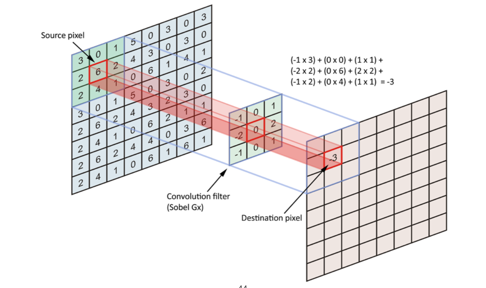
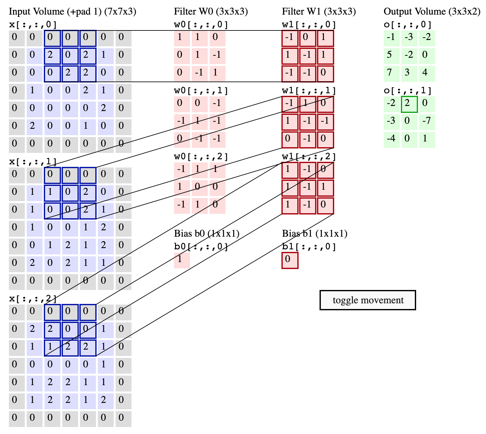
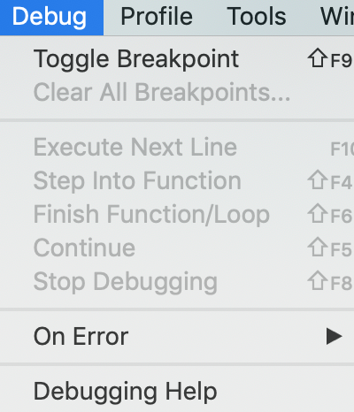
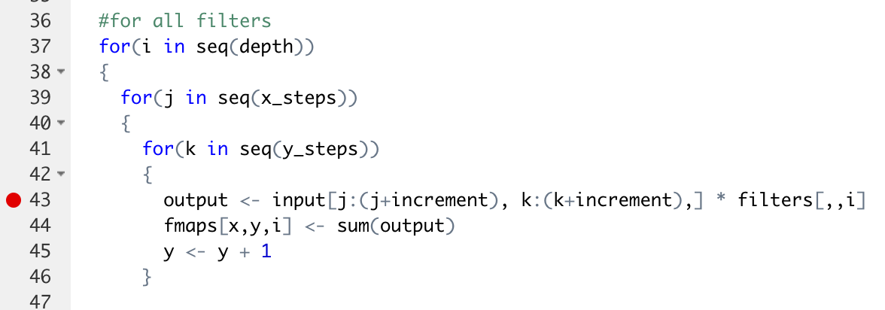
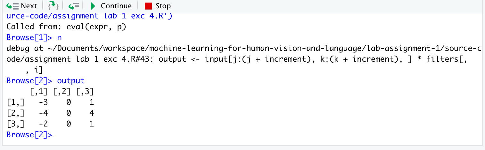

## Source Code Walkthrough

### Convolution Operation

How to calculate a 2-dimentional feature map in R, given a 2-dimensional input image with a 2-dimensional filter?

Below illustration will be implemented with a source code snippet in R.
 


Step 1: Initialise a 2-dimensional input image:
```
> input_image <- matrix(c(3,2,2,0,6,4,1,2,1), nrow=3, ncol=3)
```

Verify the matrix of the input image:
```
> input_image
     [,1] [,2] [,3]
[1,]    3    0    1
[2,]    2    6    2
[3,]    2    4    1
```

Step 2: Initialise a 2-dimensional filter:
```
> filter <- matrix(c(-1,-2,-1,0,0,0,1,2,1), nrow=3, ncol=3)
```

Verify the matrix of the filter:
```
> filter
     [,1] [,2] [,3]
[1,]   -1    0    1
[2,]   -2    0    2
[3,]   -1    0    1
```

Step 3: Calculate the element-wise multiplication (NOT matrix multiplication) of input_image and filter, and finally pass the sum of the output to the feature map:
```
> output <- input_image * filter
```

Verify the output of the element-wise multiplication:
```
> output
     [,1] [,2] [,3]
[1,]   -3    0    1
[2,]   -4    0    4
[3,]   -2    0    1
```

Calculate the sum of the output:
```
> sum <- sum(output)

> sum
[1] -3
```

Finally -3 will be passed to the feature map in the matrix position (1,1):
```
> feature_map <- array(0, c(3, 3, 1))

> feature_map
, , 1

     [,1] [,2] [,3]
[1,]    0    0    0
[2,]    0    0    0
[3,]    0    0    0

> feature_map[1,1,1] <- sum

> feature_map
, , 1

     [,1] [,2] [,3]
[1,]   -3    0    0
[2,]    0    0    0
[3,]    0    0    0
```

### Convolution Operation for Multi-Color Channels

Things to pay attention to are as below:

* When RGB image is used as input to CNN, the depth of filter (or kernel) is always equal to depth of image (so in case of RGB, that is 3). So, If 32x32x3 is the input image, the filter has to be NxNx3 (where N is height and width of filter like 3x3x3).



### How to debug in RStudio

Step 1: Move the curser to the line in the source code, and choose "Debug" -> "Toggle Breakpoint"


The red breakpoint dot will then display alongside the line you want to debug for.


Finally just run the source code as usual, and it will stop at the very line for you to debug for the temporary output.


You can proceed line by line by clicking "Next" button at the top of the console.

### References:

* https://www.statmethods.net/advstats/matrix.html
* http://www.cookbook-r.com/Numbers/Generating_random_numbers/
* https://keras.io/layers/core/
* https://cs231n.github.io/convolutional-networks/