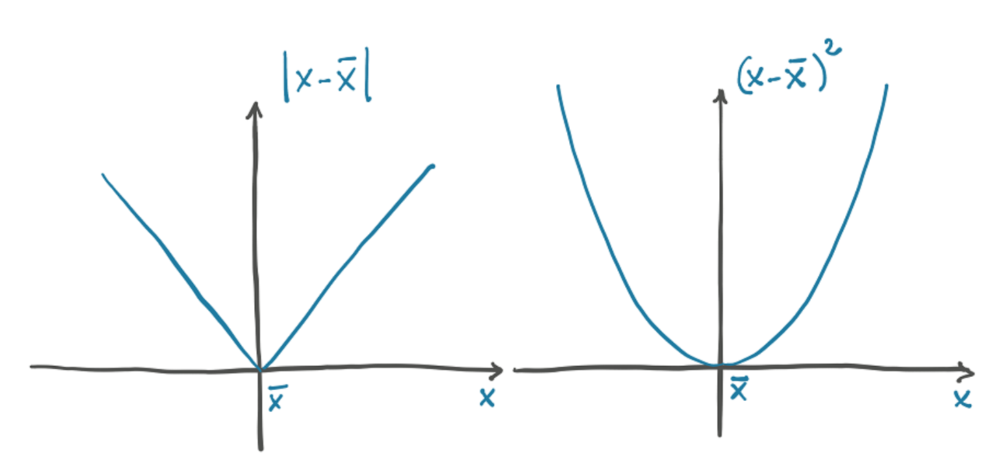
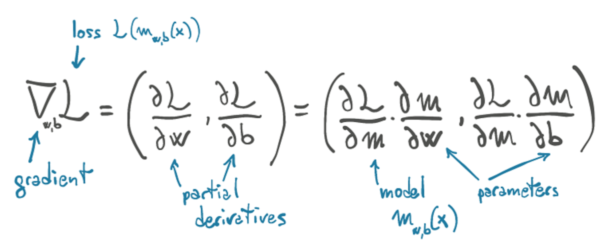

##  Gradient Descent

### Loss Function

* the derivative of error-squared loss is 0 when the loss is 0.
* error-squared loss penalizes the wrong output more than the absolute loss.
* loss function is a convex function of the model parameters.

### Gradient

gradient is a vector of derivatives, where the individual derivative of error-squared loss is computed with respect to each parameter.

