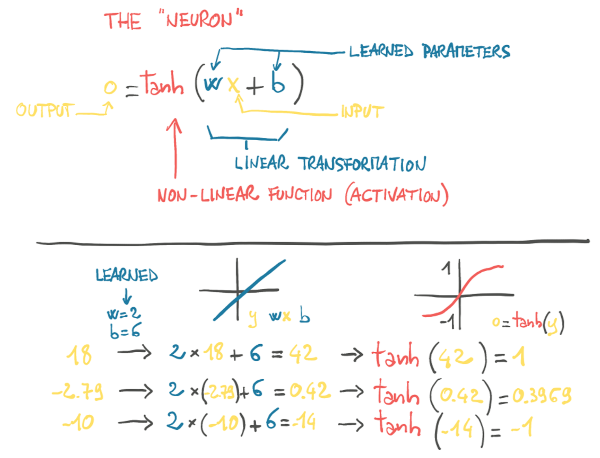
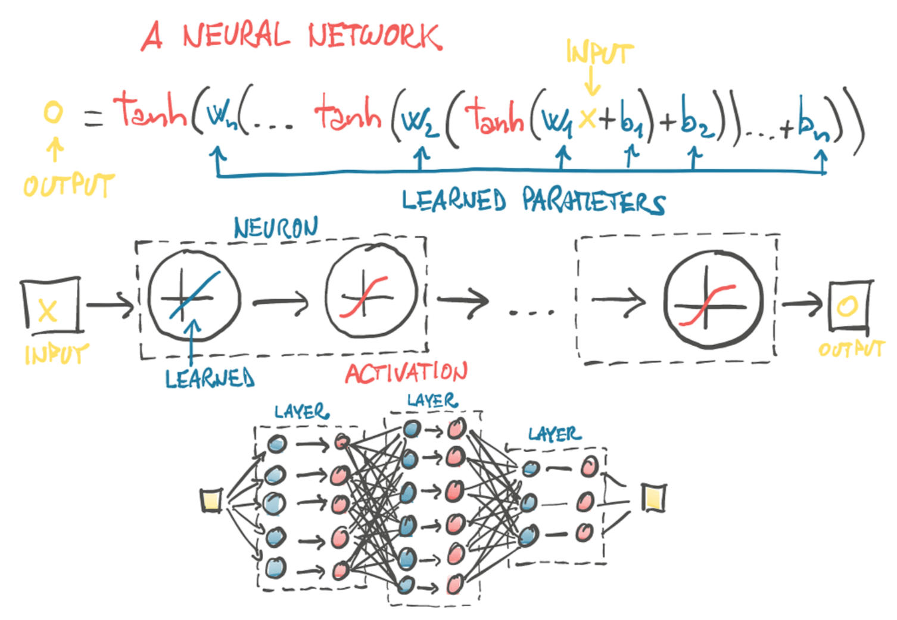
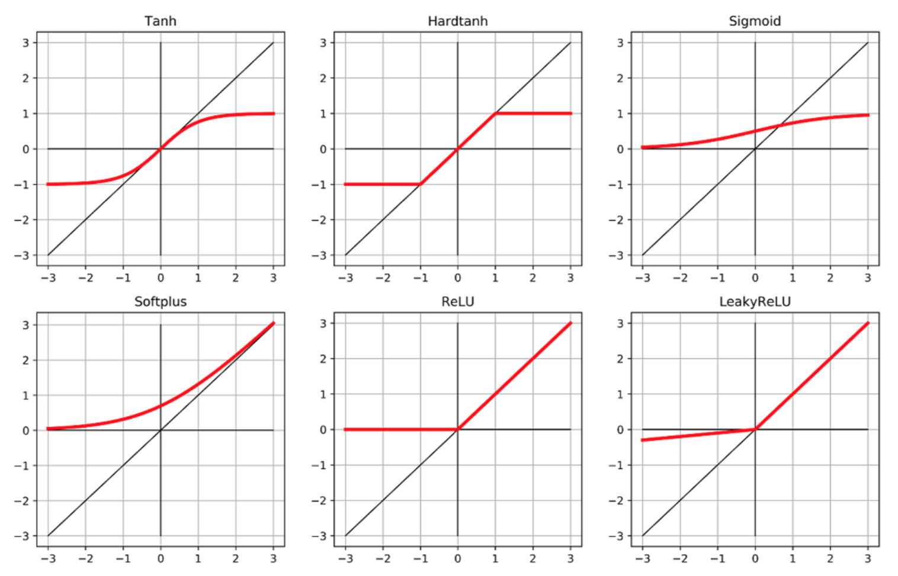
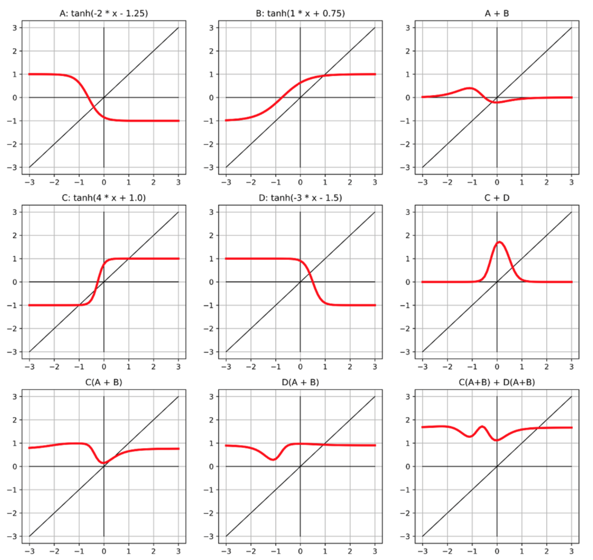

##  Gradient Descent

### Loss Function

* the derivative of error-squared loss is 0 when the loss is 0.
* error-squared loss penalizes the wrong output more than the absolute loss.
* loss function is a convex function of the model parameters.

### Gradient

gradient is a vector of derivatives, where the individual derivative of error-squared loss is computed with respect to each parameter.

### Neuron

neuron is a linear transformation of the input (w * x + b) followed by a non-linear activation function.

### Neuron Network

an output of a layer of neurons is used as an input for the next layer of neurons.

### Activation

* non-linear
* differentiable
* at least 1 sensitive range and saturated range

### 4 Neurons with 1 Layer and 2 Layers

