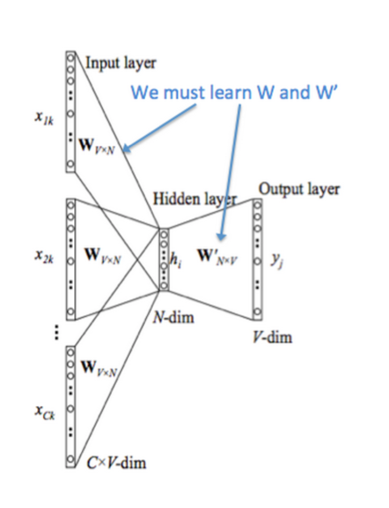

## Lexical Semantics

### Representation

* **formal semantics**: representation is based on logic, which defines concepts through enumeration of all of their features.
	* ∀x bachelor(x) → male(x) ∧ unmarried(x)

* **prototype theory**: certain members of a category are more prototypical.
	* bird: sparrow is more prototypical than penguin

* **thesaurus based meaning**: a thesaurus (**WordNet**) containing lists of **synonyms sets** and **hypernyms** (X is a Y).

* **distributional semantics**
	* distributional hypothesis: similar contexts = similar meaning.
	* vector representation: each dimension of the vector is a context word. 

### Semantic Space

* entire vocabulary
* top-n words with highest frequency

### Context

* **word window (unfiltered)**: n words on either side of the lexical item.
* **word window (filtered)**: n words on either side of the lexical item, removing function words, stopwords, etc...
* **lexeme window**: n words on either side of the lexical item, and all words are **stems**.

for **semantic similarity**, use a large window (100 words).
for **syntactic similarity**, use a small window (1-3 words).

if context size = m:

### Context Weighting

* **count-based model**: **long sparse** vectors with **interpretable** dimensions, capture global statistics, but poor on tasks like analogy.
	* **binary model**: if context c co-occurs with word w, vector w's dimension c is 1, 0 otherwise.
	* **frequency model**: vector w's dimension c is the number of times c co-occurs with w.
		* **collocation**: words that co-occur more often than expected by chance.
		* **pointwise mutual information (PMI)**: PMI(x,y) = log2(P(x, y) / P(x)P(y)), if x and y are independent.
		* good collocation pairs have high PMI.
		* **positive pointwise mutual information (PPMI)**: change all negative PMI to 0.

* **prediction-based model**: **short dense** vectors with **latent** dimensions.
	* **Word2Vec**: shallow window-based, capture complex linguistic patterns beyond similarity, but fail to make use of global statistics.
		* **CBOW (continuous bag of words)**: predict a center word from the context = P(w|c).
		* **skipgram**: predict the context from a center word = P(c|w).
	* **GloVe**: trained on global word co-occurrence counts, capture complex linguistic patterns beyond similarity, and make use of global statistics.
		* **co-occurrence matrix**: Pij = P(wj|wi) = Xij / Xi
		* Xij: the number of times word j occurs in the context of word i
		* Xi: the number of times any word k occurs in the context of word i

#### Skipgram

CBOW vs skipgram:

	
	

* P(wk|wj) = similarity between wk and wj = similarity as dot product between target vector wj and context vector ck

#### GloVe

co-occurrence probabilities:

GloVe visualization:

	
	

### Evaluation

* **similarity**: **normalized dot product** = **cosine** of the angle between vectors.
	* sim(v, w) = (v . w) / (|v||w|)
	* range = [-1, 1]: -1 (vectors pointing to the opposite directions), 1 (vectors pointing to the same directions)
	* cat - dog are similar (substitutable in many contexts)

* **relatedness**: 
	* cat - purr are related (occur in the same contexts)

* **analogy**: a is to b as c is to d.
	* analogy = vector offsets: a - b ≈ c - d
	* man - woman ≈ king - queen
