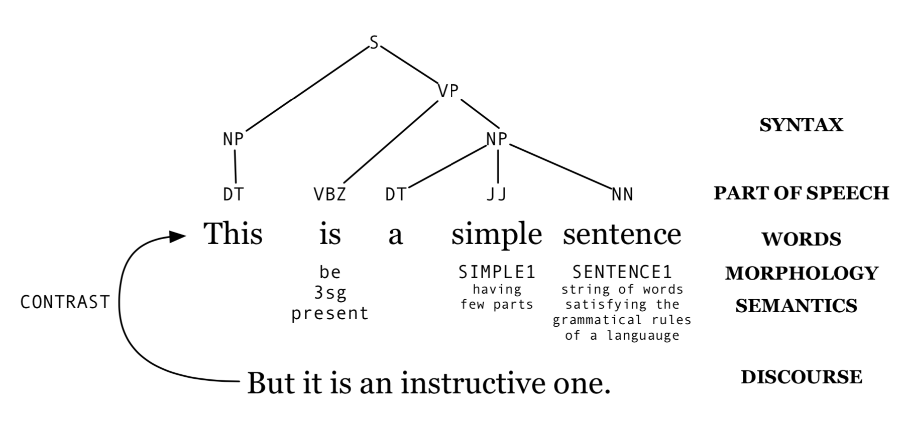
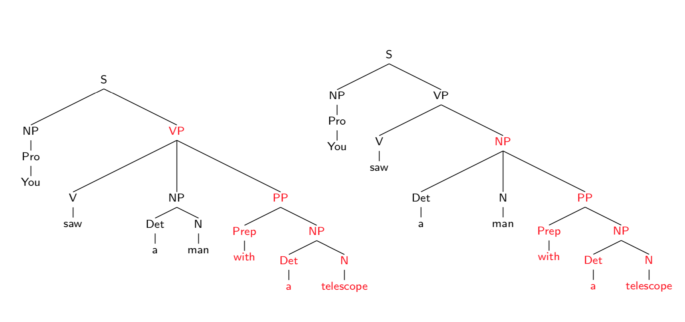
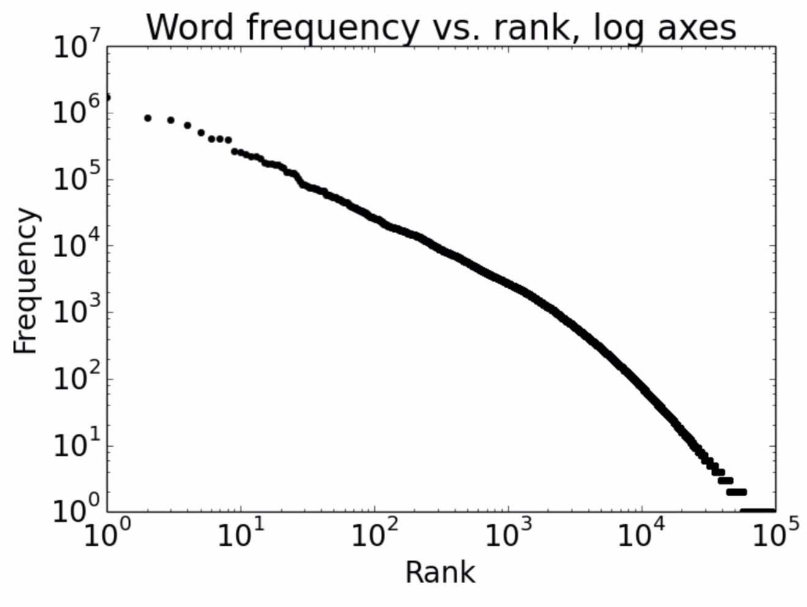

## Linguistics

###  Syntax & Semantics
* **syntax**: structural relationship between words and phrases (modelling sequence: RNN)
* **semantics**: **lexical semantics** (distributional/vector based: word embedding) and **compositional semantics**

### Ambiguity
* **words**: 
	* multiple meanings: bank (financial institution or river bank?)
	* vague meanings: a small elephant > a big rabbit
* **part of speech**: chair (verb or noun?), can (auxiliary verb or noun?)
* **syntax**: you saw a man with a telescope.

* **semantics**: 
	* **quantifier**: some, all, many, a, one, etc...
	* **quantifier scope**: 
		* the company sent a new battery to every car owner (how many batteries?)
		* the company sent a doctor to treat every employee affected by the accident (how many doctors?).

### Challenge
* **variability**: did Google buy YouTube?
	* Google purchased YouTube.
	* Google’s acquisition of YouTube.

* **context-dependent**
* **world knowledge**

### Zipf's Law
* **word counts**
* **word frequencies**
	* f × r ≈ k
		* f: frequency of a word
		* r: rank of a word
		* k: a constant
		* logf = logk − logr  

### Probability of a sentence

**probability of a sentence** helps decide **word choice** and **word order**, e.g. P(She is going home) > P(She is going house)

**chain rule** is used to decompose the probability of a sentence:

P(w1n) = P(w1) P(w2|w1) P(w3|w1,w2) ... P(wn|w1 ...wn−1)
* history of size 2: P(w1n) ≈ P(w1) P(w2|w1) P(w3|w1, w2) ... P(wn|wn−2, wn−1)
* history of size 1: P(w1n) ≈ P(w1) P(w2|w1) P(w3|w2) ... P(wn|wn−1)
* history of size 0: P(w1n) ≈ P(w1) P(w2) P(w3) ... P(wn)

**maximum likelihood estimation (MLE)**
* hisotry of size 2: P(wi|wi−2,wi−1) = count(wi−2,wi−1,wi) / count(wi−2 ,wi−1)
* history of size 1: P(wi|wi−1) = count(wi−1,wi) / count(wi−1)
* history of size 0: P(wi) = count(wi) / N, where N is the number of words in the corpus

### Language model

* **uni-gram** model (**bag of words**): each word is independent of the others in the sentence, e.g. P(three guys are standing on the sidewalk) = P(sidewalk the three are on guys standing)
* **bi-gram** model: each word is independent of all but the previous word.
* **tri-gram** model: each word is independent of all but the previous two words, e.g. P(sidewalk|three guys are standing on the) = P(sidewalk|on the) = P(see the small dog on the)

