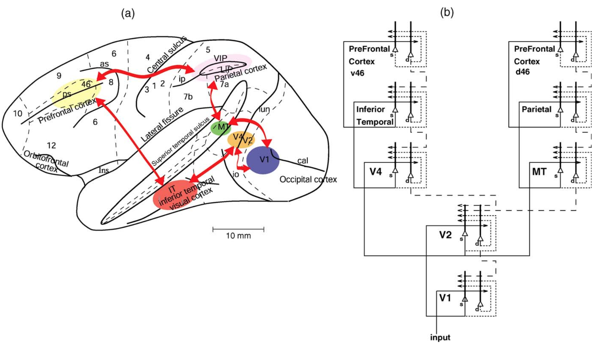

## Neuroscience

###  Visual pathway

 (a) Lateral view of the macaque brain showing the connections in the ventral and dorsal visual streams (V1: primary visual area, V2, V4: extrastriate visual areas, IT: inferior temporal, PP: posterior parietal) and the anterior (PFCv: ventrolateral prefrontal cortex, PFCd: dorsolateral prefrontal cortex) brain areas. 

 (b) The systems-level architecture of a model of the cortical mechanisms of visual attention and memory. The system is essentially composed of six modules which model the two known main visual pathways of the primate visual cortex. Information from the retina via the lateral geniculate nucleus enters the visual cortex through area V1 in the occipital cortex and proceeds into two forward or bottom-up processing streams. The occipital-temporal stream leads ventrally through V2–V4 and IT, and is mainly concerned with object recognition. The occipito-parietal stream leads dorsally into PP and is responsible for maintaining a spatial map of an object’s location. Both posterior visual pathways send connections to and receive connections from the lateral prefrontal cortex, where short-term memory functions take place. Forward connections are indicated by solid lines; backprojections, which could implement top-down processing, by dashed lines; and recurrent connections within an area by dotted lines. s—superficial pyramidal cells; d—deep pyramidal cells.

