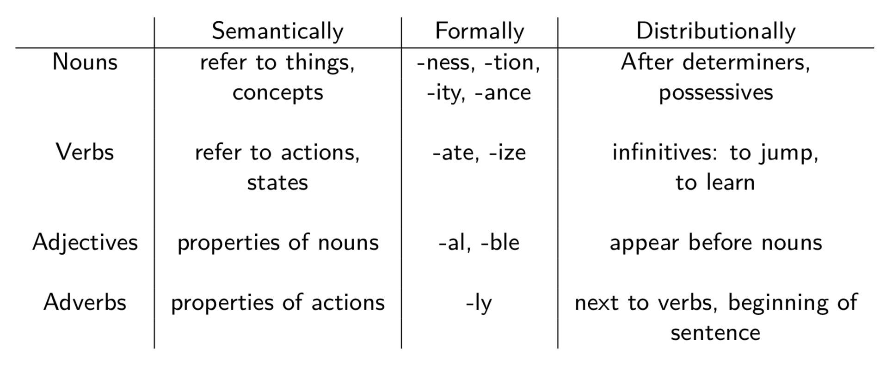
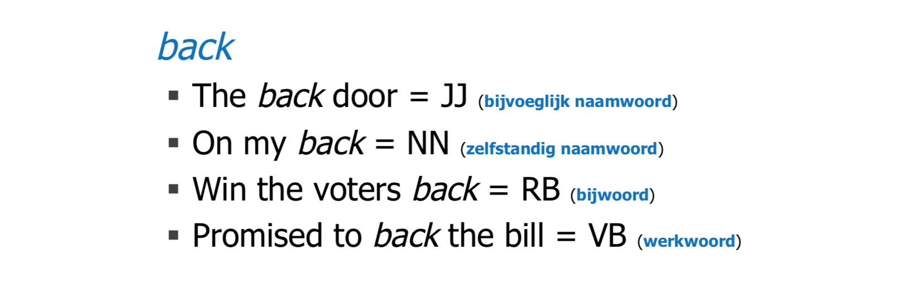
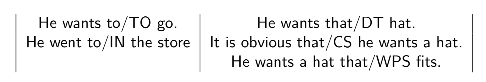
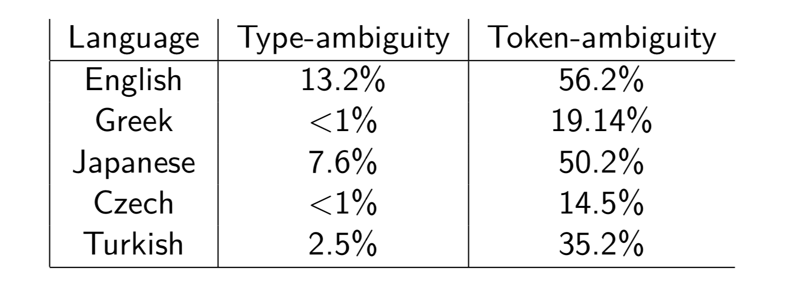
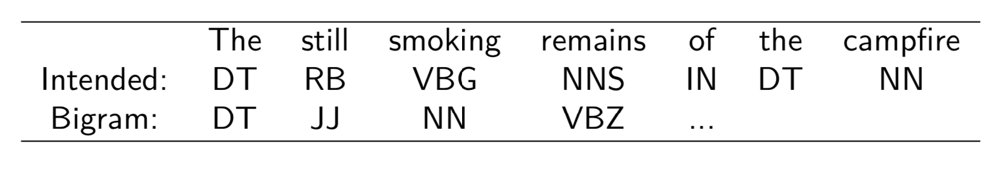

## POS (Part Of Speech) Tagging

### Criteria

* **semantic** criteria: what does the word refer to?
* **distributional** criteria: in which context can the word occur?
* **formal** criteria: what form does the word have?

distributional and formal criteria are useful to navigate the "unknown" words.

### Ambiguity

* 10.4% **word types** have 2-7 POS tags.
* above 50% **word tokens** are ambiguous.

	
	

ambiguity in different languages:

### Strategy

* **uni-gram tagging**: assign to each word the most common tag (90% accuracy). 
* **bi-gram tagging**: assign to each word the most likely tag given the preceding tag.
	* cascading wrong tags
	* no lookahead

