## POS (Part Of Speech) Tagging

### Criteria

* **semantic** criteria: what does the word refer to?
* **distributional** criteria: in which context can the word occur?
* **formal** criteria: what form does the word have?

distributional and formal criteria are useful to navigate the "unknown" words.

### Ambiguity

* 10.4% **word types** have 2-7 POS tags.
* above 50% **word tokens** are ambiguous.

	
	

ambiguity in different languages:

### Strategy

* **uni-gram tagging**: assign to each word the most common tag (90% accuracy). 
* **bi-gram tagging**: assign to each word the most likely tag given the preceding tag.
	* cascading wrong tags
	* no lookahead

### Bayes' Theorem

	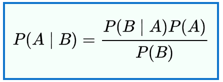

* P(A|B) is a conditional probability: the likelihood of event A occurring given that event B is true.
* P(B|A) is a conditional probability: the likelihood of event B occurring given that event A is true.
* P(A) and P(B) are the probabilities: the likelihood of event A and event B occurring independently of each other.

	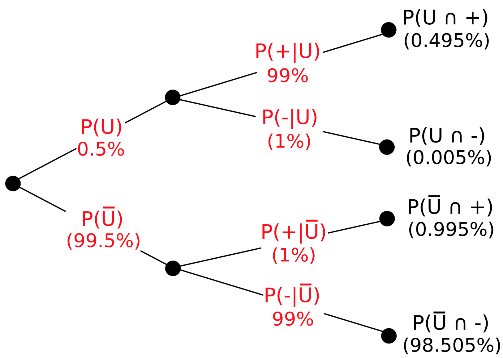

### Computation

* a sentence w1n is a sequence of n words: (w1 w2 ... wn).
* POS tags t1n for the sentence is a sequence of n tags: (t1 t2 ... tn).

**goal** - **most probable** tag sequence:

	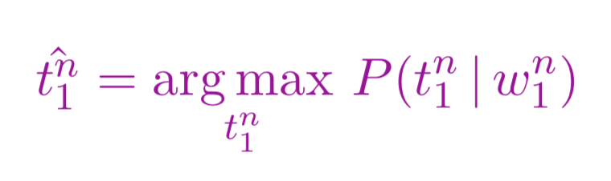

**step 1** - use Bayes' theorem:

	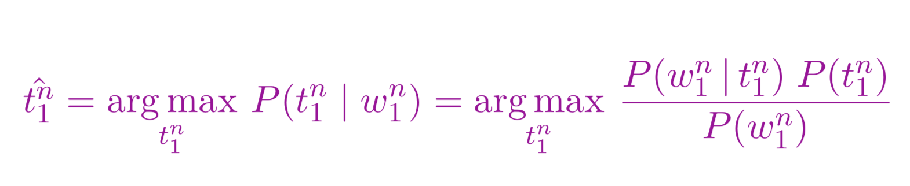

**step 2** - ignore the denominator:

* P(t1<n): **prior term**.
* P(w1<n|t1<n): **likelihood term**.

	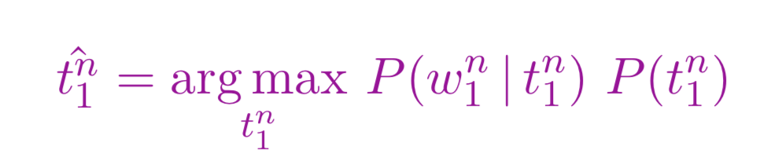

**step 3** - simplify assumptions:

for **prior term**, use bi-gram of tags.

	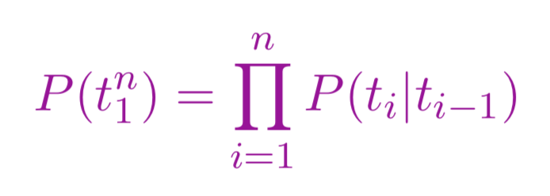

for **likelihood term**, the probability of a word only depends on its POS tag, not on other words/tags in the sequence.

	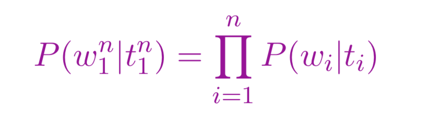

**model** - equation:

	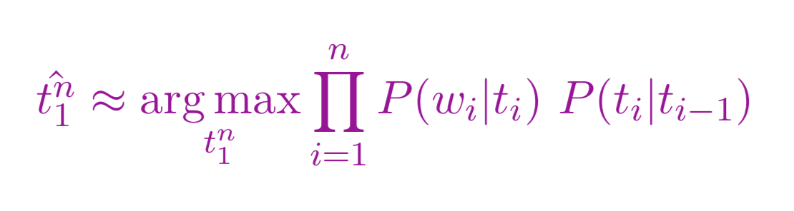

### Estimate the parameters of the model from a corpus

**tag transition probabilities**

	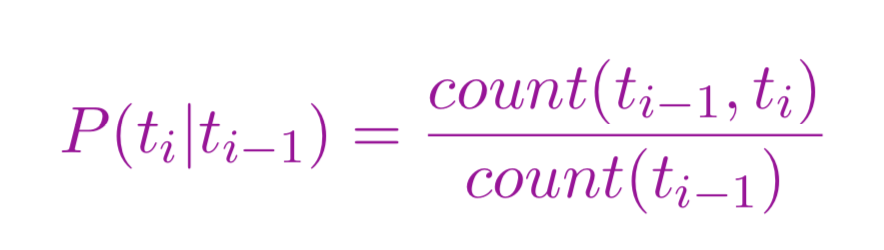

example from Brown corpus:
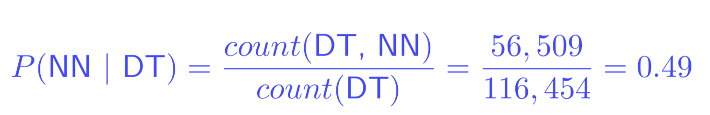

**word likelihood probabilities**

	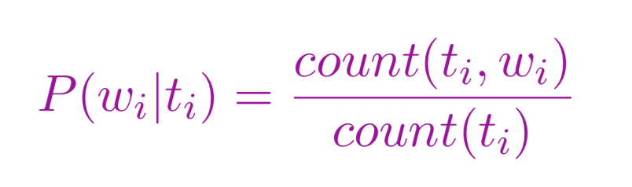

example from Brown corpus:
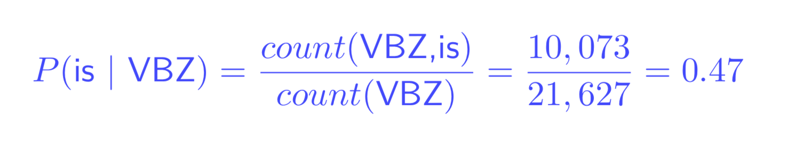

### HMM (Hidden Markov Model)

elements of HMM (**probabilistic finite state machine**):
* a set of N states/tags (N tags)
* an output of V words (V words)
* initial state (beginning of a sentence)
* **transition probability**: 
	* P(ti|ti−1)
	* A is an N x N matrix of transition probability, aij is the probability of transitioning from state i to state j.
* **emission probability**: 
	* P(wi|ti)
	* B is an N x V matrix of emission probability, bi(o) is the probability of emitting o from state i.

**λ = (A, B) is the parameter of a HMM**.

the equation in a HMM:
* output sequence O = (o1 o2 ... oT)
* tag sequence Q = (q1 q2 ... qT)

	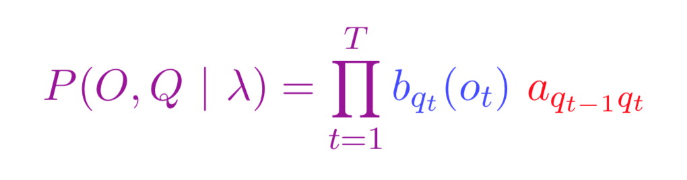

### Viterbi Algorithm

**enumeration of tag sequence won't work**
* c = 10 possible tags, n = 10 words, enumerated tag sequences = cn = 10,000,000,000 tag sequences

**Viterbi intuition**
* the best path of length t ending in state j must include the best path of length t−1 at the previous state i.
* v(j, t) is the probability of the best word sequence (o1 o2 ... ot) that ends in state j.

	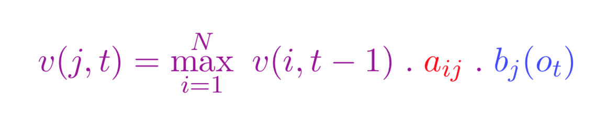

example of Viterbi
* matrix of transition probability A: 2 x 2, N = {q1, q2}
* matrix of emission probability B: 2 x 3, V = {x, y, z}
* the word sequence (o1 o2 o3), that is (x z y)
* compute the tag sequence? answer is (q1 q1 q2)

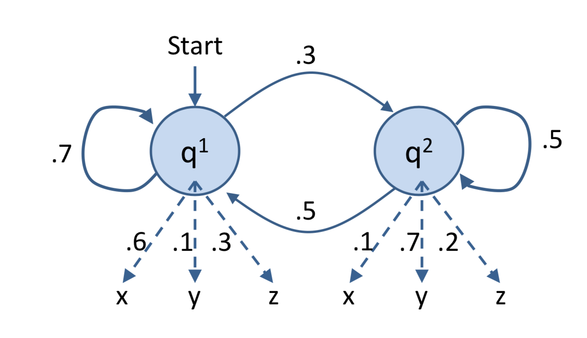
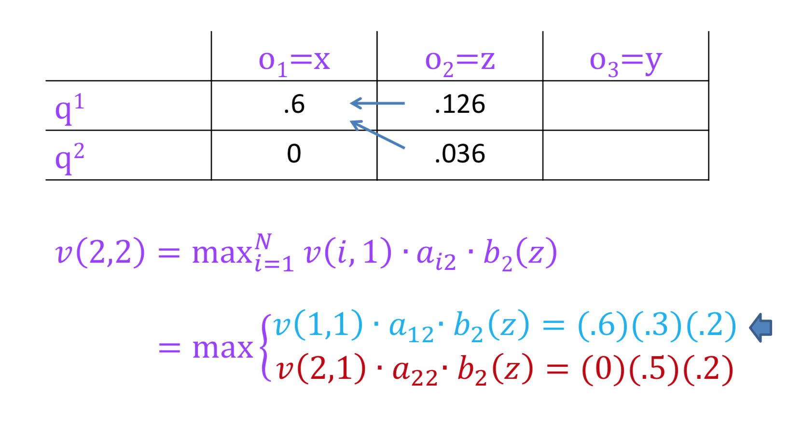
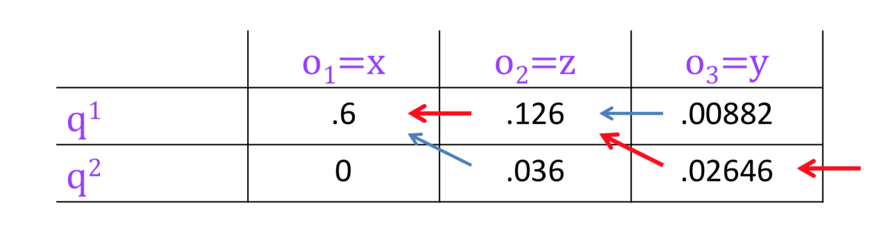
