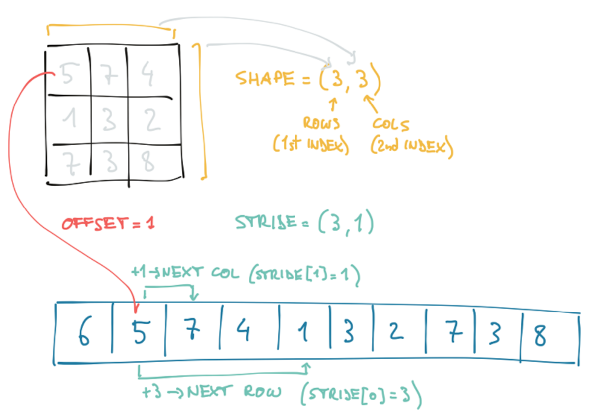

## PyTorch

### Storage



```
import torch

points = torch.tensor([[5, 7, 4], [1, 3, 2], [7, 3, 8]])

points.storage()
points.stride()
points.shape
points.dtype
points[1,].storage_offset()

points_transpose = points.t()
points_transpose = points.transpose(0, 1)

points_transpose.storage()
points_transpose.stride()
points_transpose.shape

id(points.storage()) == id(points_transpose.storage()) # the storage is the same, only the view is changed
```

### Numeric Types

The numeric types are as below:
* torch.float32 = torch.float -> torch.FloatTensor or torch.Tensor (**default**)
* torch.float64 = torch.double -> torch.DoubleTensor
* torch.float16 = torch.half
* torch.int8 -> torch.CharTensor
* torch.uint8 -> torch.ByteTensor
* torch.int16 = torch.short
* torch.int32 = torch.int
* torch.int64 = torch.long
* torch.bool -> torch.BoolTensor

The allocation of a tensor with the right umeric type:
```
import torch

double_tensor = torch.ones(10, 2, dtype=torch.double)
double_tensor = torch.ones(10, 2).double()
double_tensor = torch.ones(10, 2).to(torch.double)
double_tensor = torch.ones(10, 2).to(dtype=torch.double)

float_tensor = torch.ones(10, 2)
double_tensor = float_tensor.type(torch.double)
```

