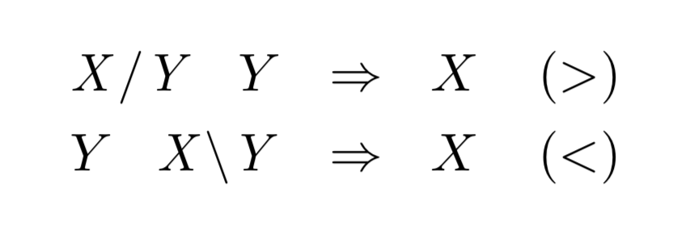
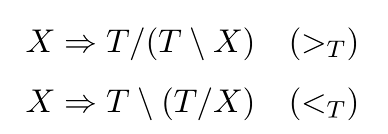
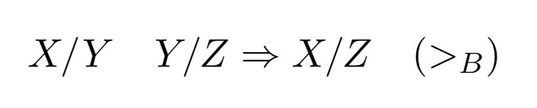
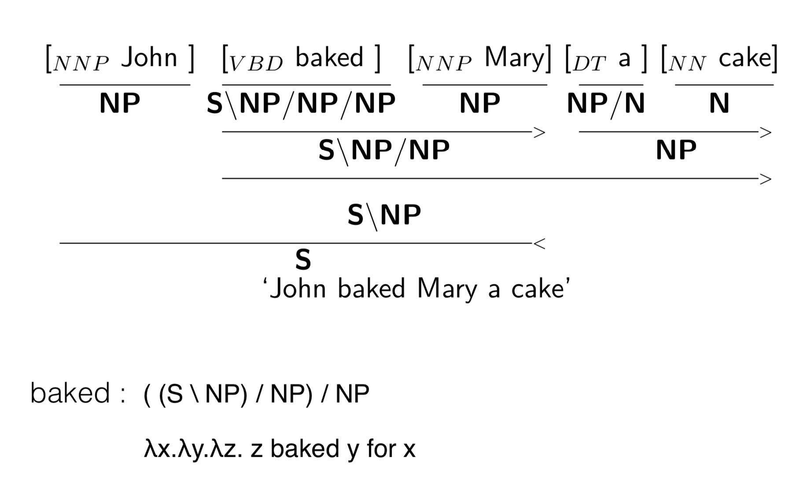
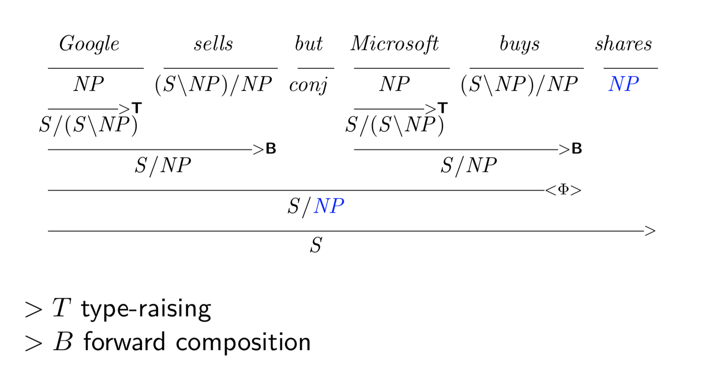

## Supertagging

Supertagging is based on **"strongly lexicalised"** grammar.

**CCG (Combinatory Categorial Grammar)** is a strongly lexicalised grammar.

for each word, there is:
* **lexical categories**
	* atomic categories: S, N, NP, PP, etc...
	* complex categories: built recursively from atomic categories and slashes.
		* **intransitive verb** - S\NP: walk
		* **transitive verb** - (S\NP)/NP: respect
		* **ditransitive verb** - ((S\NP)/NP)/NP: give
* **semantic interpretation**
	* λx.WALK(x): walk
* **combinators**: rules which define how lexical categories can be combined.
	* **forward application (>)**
	* **backward application (<)**
	* **type raising (T)**
	* **forward composition (B)**

examples of CCG derivation

