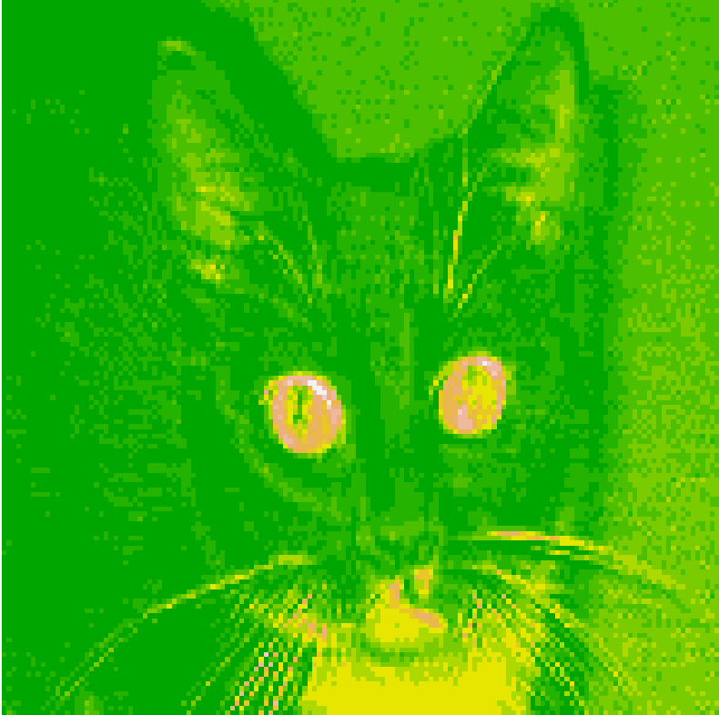
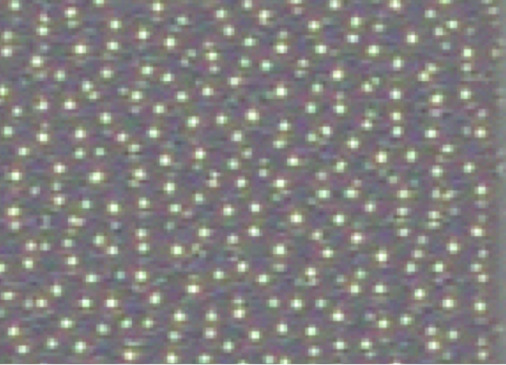
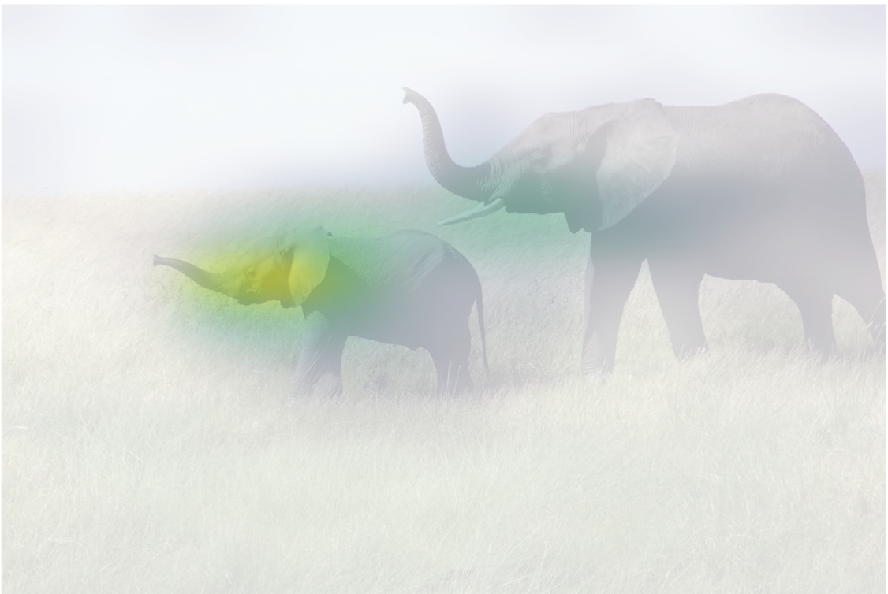

## Visualization

### Visualize the output from each layer

The source code is in this link: [convnet_output](./source-code/convnet_output.R)

input image vs. output feature map from layer 1 and channel 2

  
   

### Visualize the filter from each layer

The source code is in this link: [convnet_filter](./source-code/convnet_filter.R)

The feature with which the layer "block3_conv1" and its filter 1 deals is as below:

### Visualize the heatmap (that is, which part of the original image contributes to the predictions)

The source code is in this link: [heatmap](./source-code/heatmap.R)

The heatmap is as below:

